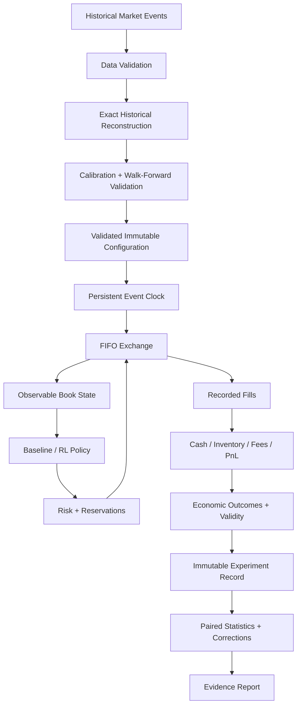

# CLEOLOB — Market Microstructure Research Lab

**CleoLOB** is a reproducible research laboratory for limit-order-book mechanics, execution algorithms, historical L2 reconstruction, reinforcement learning, risk, and statistical strategy comparison.

It is built around a simple principle:

> **A positive synthetic backtest is not evidence of live alpha.**

Unpriced inventory, invalid experiments, missing comparisons, failed runs, and model limitations are reported rather than silently discarded.

[](https://github.com/damraka/CleoLOB/actions/workflows/research.yml)


---

## Highlights

|                               |                                                                                |
| ----------------------------- | ------------------------------------------------------------------------------ |
| **521 tests**                 | Integrated unit, randomized-invariant, integration and regression suite        |
| **5,972,671**                 | Real Deribit L2 updates processed                                              |
| **2,081,479**                 | Top-five order-book snapshots matched exactly                                  |
| **46,195**                    | Public trade records checked                                                   |
| **Deterministic experiments** | Separate random streams, persistent clocks and reproducible run manifests      |
| **Execution research**        | TWAP, VWAP, POV, Almgren–Chriss, heuristics, random policies and PPO interface |
| **Statistical inference**     | Paired bootstrap, exact sign tests and multiple-testing correction             |
| **Historical reconstruction** | Exact event replay without inventing counterfactual fills                      |

CleoLOB combines a deterministic synthetic exchange with real-market reconstruction and research infrastructure designed to make experiments **auditable, reproducible and difficult to accidentally overstate**.


---

## What CleoLOB Is

CleoLOB is intended for research into:

* limit-order-book mechanics,
* optimal execution,
* market microstructure,
* execution cost and risk,
* reinforcement-learning execution agents,
* historical L2 reconstruction,
* calibration and walk-forward validation,
* stress testing,
* portfolio exposure,
* and reproducible strategy comparison.

It is **not** a live trading system.

There is no broker integration, real-money order submission, or claim of demonstrated live alpha.

---

## Research Philosophy

Market-microstructure experiments are extremely easy to overstate.

A strategy can appear profitable because of:

* unrealistic fills,
* unpriced residual inventory,
* look-ahead bias,
* inconsistent randomness,
* missing fees,
* survivorship of successful experiments,
* poorly calibrated synthetic order flow,
* or repeated hypothesis testing without correction.

CleoLOB is designed to expose these failure modes instead of hiding them.

The framework therefore treats experiment validity, provenance and failure reporting as first-class parts of the research process.

---

# Core Capabilities

## Deterministic FIFO Exchange

The synthetic exchange supports:

* integer price ticks and order quantities,
* FIFO price-time priority,
* GTC orders,
* IOC orders,
* FOK orders,
* GTD orders,
* post-only orders,
* partial fills,
* cancellation,
* modification,
* conditional cancel/replace,
* explicit order states,
* queue positions,
* and invariant checks.

Persistent event clocks provide deterministic tie-breaking while separate random streams isolate independent sources of stochasticity.

Delayed messages and cancellation races are explicitly modeled.

Changing the observation frequency of a simulation does not change its underlying exogenous event path.

---

## Execution Algorithms

Built-in execution strategies include:

* **TWAP**
* **synthetic-profile VWAP**
* **POV**
* **Almgren–Chriss**
* heuristic policies,
* random policies,
* and a Stable-Baselines3 **PPO** interface.

Registered research commands require an actual PPO checkpoint when PPO is selected, preventing an unavailable learned policy from silently falling back to another strategy.

---

## Accounting and Execution Risk

CleoLOB tracks:

* cash,
* signed inventory,
* average-cost PnL,
* realized execution effects,
* maker/taker fees,
* rebates,
* working orders,
* and in-flight reservations.

Risk controls include:

* child-order limits,
* position limits,
* notional limits,
* loss limits,
* conservative reservations,
* and a latched kill switch.

Outstanding orders are reconciled through a bounded post-horizon settlement phase.

Late fills and fees are included when they actually occur.

Unresolved orders can invalidate final economic metrics rather than being ignored.

---

# Real-Market L2 Reconstruction

CleoLOB includes a separate historical reconstruction pipeline for recorded market data.

Supported functionality includes:

* bounded CSV/JSONL ingestion,
* exact order IDs,
* snapshots,
* incremental events,
* source hashing,
* data-quality reports,
* pause/resume/reset,
* deterministic reconstruction,
* and stepwise replay.

Historical events are reconstructed separately from the synthetic matching engine so that recorded fills are not accidentally modified by synthetic exchange mechanics.

## Public L2 Validation

The public-data pipeline supports bounded Tardis samples with:

* download verification,
* gzip/checksum validation,
* exact decimal price handling,
* price-level reconstruction,
* snapshot comparison,
* trade checks,
* and causal one-second descriptive statistics.

A real-data validation study processed Deribit ETH perpetual samples from:

* **April 1, 2020**
* **May 1, 2020**

with the following results:

| Validation metric               |        Result |
| ------------------------------- | ------------: |
| L2 updates processed            | **5,972,671** |
| Top-five snapshots compared     | **2,081,479** |
| Exact top-five snapshot matches | **2,081,479** |
| Trades checked                  |    **46,195** |

This validates **aggregate historical reconstruction**.

It does **not** establish historical strategy profitability because aggregate L2 data alone does not identify the counterfactual queue position and fills that an unobserved strategy would have received.

See:

* [`examples/studies/historical/README.md`](examples/studies/historical/README.md)
* [`docs/public-market-data.md`](docs/public-market-data.md)

---

# Calibration and Validation

Historical observable models support:

* causal feature construction,
* frozen calibration artifacts,
* chronological train/test separation,
* purged splits,
* expanding walk-forward folds,
* later-date validation,
* drift diagnostics,
* coverage diagnostics,
* and deterministic observable generation.

Calibration artifacts can therefore be separated from later evaluation periods rather than allowing future information to leak backward into a study.

The current aggregate-L2 calibration layer does **not** identify queue-level arrival and cancellation dynamics.

The synthetic FIFO order-flow model should therefore not be interpreted as a fully calibrated representation of a real exchange.

---

# Reproducible Experiments

Every registered experiment can produce an isolated run directory containing evidence such as:

* normalized configuration,
* configuration hash,
* source snapshot,
* source hash,
* checkpoint identity,
* random seed manifest,
* episode outcomes,
* order logs,
* fill logs,
* risk events,
* validity information,
* statistics,
* and offline HTML reports.

Runs can be verified and compared rather than relying solely on final summary tables.

Example:

```bash
cleo reproduce examples/studies/foundation/20260913T191627-0268a8fa8cb3
cleo verify examples/studies/foundation/20260913T191627-0268a8fa8cb3
cleo experiment diff PATH_TO_FIRST_RUN PATH_TO_SECOND_RUN
```

Reproduction creates a new result directory.

It does not execute archived Python code or overwrite the original experiment.

---

# Statistical Research Design

CleoLOB includes tools for paired experimental designs and uncertainty-aware comparison.

Implemented methods include:

* paired bootstrap intervals,
* exact sign tests,
* Holm correction,
* Bonferroni correction,
* Benjamini–Hochberg correction,
* complete-pair validation,
* and bounded sampling of large finite parameter spaces.

Planned experiments that fail or produce economically unpriceable outcomes are retained.

If the required observations for a valid comparison do not exist, comparative inference can be withheld rather than calculated from a selectively surviving subset.

---

# Foundation Study

The included foundation study compares six baseline/heuristic execution policies using ten paired seeds:

**60 total episodes**

with:

* 2,000-share sell orders,
* 10-second horizons,
* 1 bps taker fees,
* full run evidence,
* configuration snapshots,
* source identity,
* and audit logs.

No PPO or SAC comparison was run in this study.

Every candidate-minus-TWAP bootstrap interval contains zero, and all five Holm-adjusted sign-test p-values are `1.0`.

Therefore:

> **The foundation study does not establish that any tested strategy outperforms TWAP.**

The experiment was performed in one uncalibrated synthetic market and should not be interpreted as evidence of live trading performance.

See:

[`examples/studies/foundation/README.md`](examples/studies/foundation/README.md)

Older 100-seed results generated under different market mechanics are retained separately for provenance:

[`results/baselines-100seeds/`](results/baselines-100seeds/)

They are archived results, not validation of the current engine.

---

# Stress Testing

Registered stress families allow strategies to be evaluated across multiple controlled scenarios while preserving:

* source identity,
* model identity,
* configuration identity,
* complete outcome retention,
* and family-wide statistical correction.

This allows sensitivity analysis without treating every parameter variation as an unrelated experiment.

Example:

```bash
cleo stress --config configs/robustness.yaml
```

---

# Portfolio Risk

CleoLOB includes linear multi-asset portfolio accounting with support for:

* multiple currencies,
* joint asset/FX scenarios,
* conservative reservations,
* exposure limits,
* loss limits,
* and portfolio-level stress evaluation.

Example:

```bash
cleo portfolio --config configs/portfolio_example.json
```

The current implementation is a **linear portfolio risk framework**.

It is not a nonlinear derivatives pricing or Greeks engine.

---

# Architecture



## Main Modules

| Module              | Responsibility                                    |
| ------------------- | ------------------------------------------------- |
| `lob/engine.py`     | Order lifecycle, FIFO book and synthetic exchange |
| `lob/accounting.py` | Cash, inventory, fees and PnL                     |
| `lob/risk.py`       | Execution limits and reservations                 |
| `lob/execution.py`  | Execut                                            |
