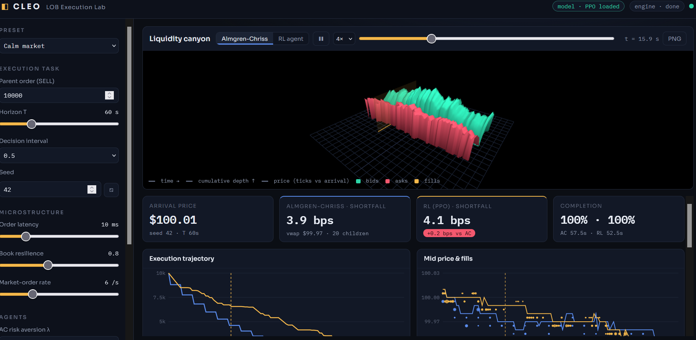
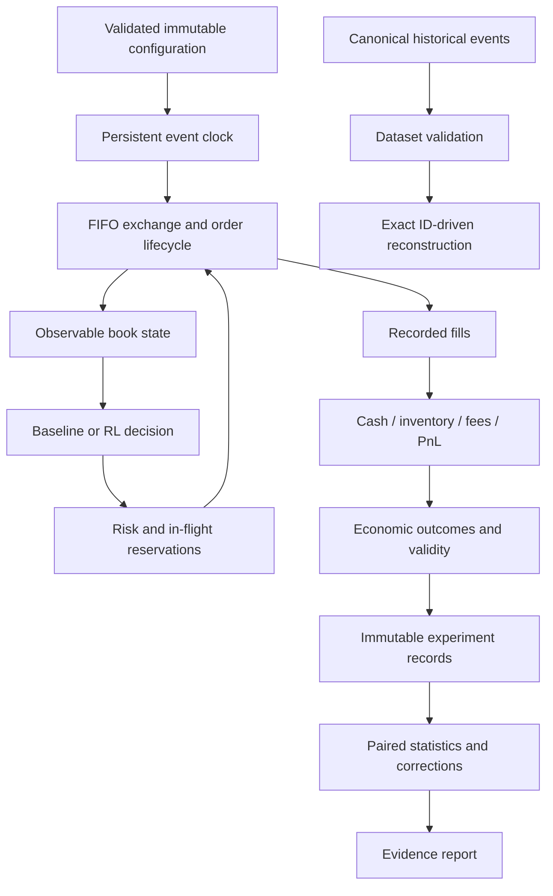

# CLEOLOB — Market Microstructure Research Lab

A Python laboratory for limit-order-book mechanics, execution strategies, historical
reconstruction, and reproducible comparisons. The engine, accounting and experiment
records are designed to expose invalid assumptions and failed strategies.

> A positive synthetic backtest is not evidence of live alpha. Unpriced inventory,
> missing experiments and failed comparisons are reported rather than concealed.



## Implemented and tested

- **FIFO exchange:** integer ticks/lots, GTC/IOC/FOK/GTD, post-only, partial fills,
  cancel, modify and conditional cancel/replace; explicit order states, queue
  positions and invariant checks.
- **Persistent event clocks:** deterministic tie-breaking, separate random streams,
  delayed messages and cancellation races. Dividing a simulation into different
  observation steps preserves its background event path.
- **Accounting and execution risk:** cash, signed inventory, average-cost PnL,
  maker/taker fees and rebates; in-flight reservations prevent parent overfills.
  Child/position/notional/loss limits and a latched kill switch are available.
- **Execution baselines:** TWAP, synthetic-profile VWAP, POV and Almgren–Chriss,
  plus heuristic/random policies and the existing SB3 PPO interface. Research
  commands require a checkpoint when PPO is requested.
- **Historical reconstruction:** bounded CSV/JSONL input, exact order IDs,
  snapshots and incremental events, source hashes, quality reports, step/pause/
  resume/reset. This reconstructs recorded events without inventing agent fills.
- **Public aggregate L2 data:** bounded Tardis sample downloads, checksum/gzip
  verification, exact decimal price-level replay, snapshot comparisons and
  causal one-second descriptive statistics. Two full real-market days tested.
- **Calibration and validation:** frozen empirical L2 observable models, causal
  features, purged chronological splits, expanding walk-forward folds,
  later-date drift/coverage scorecards and deterministic observable generation.
- **Settlement and portfolio risk:** post-horizon cancellation/fill reconciliation,
  explicit late fees and timeouts; multi-currency linear portfolio accounting,
  conservative reservations, exposure/loss limits and joint asset/FX scenarios.
- **Registered stress families:** multi-scenario execution, frozen source/model
  identity, complete outcome retention and family-wide statistical correction.
- **Research configuration:** typed immutable YAML/JSON, inheritance, environment
  and CLI overrides, schema export, validation, normalized hashes and diffs.
- **Experiment evidence:** unique run directories, source snapshots, config and
  checkpoint hashes, every episode outcome, order/fill/risk logs, offline HTML
  reports, integrity verification and exact reproduction checks.
- **Statistics and design:** paired bootstrap intervals, exact sign tests,
  Holm/Bonferroni/BH correction, complete-pair validation and bounded sampling of
  large finite parameter spaces. Failed or unpriced planned outcomes withhold
  comparative inference.

The existing FastAPI/Three.js app and legacy Streamlit dashboard remain available.
The web comparison now displays economic effective shortfall and unpriced outcomes;
its fallback heuristic is labeled. It is an exploration UI, while registered research
uses the stricter CLI workflow.

## Quickstart

Python 3.11+ is supported by package metadata; this batch was tested locally on
Python 3.14.6 / Windows 11. Linux CI for 3.11 and 3.13 is configured but has not been
run from this workspace.

```sh
python -m venv .venv
# Windows PowerShell: .\.venv\Scripts\Activate.ps1
# macOS/Linux: source .venv/bin/activate
python -m pip install -e '.[dev]'

python -m pytest -q
cleo config validate configs/research.yaml
cleo evaluate --config configs/research.yaml
cleo validate-data examples/data/canonical-events.jsonl
cleo replay examples/data/canonical-events.jsonl
cleo benchmark --pairs 2000 --repeats 3
cleo stress --config configs/robustness.yaml
cleo portfolio --config configs/portfolio_example.json
```

Install `python -m pip install -e '.[dev,rl,web]'` for PPO and the web dashboards,
or use the existing `requirements.txt`. Run `python server.py --no-browser` and
open `http://127.0.0.1:8000`. No credentials or live-market connection are needed.

`python -m lob.cli` is equivalent to `cleo`; `python -m lob` retains the standalone
simulation demonstration. No broker integration or real-money order submission is
included.

## A reproducible study

[The foundation study](examples/studies/foundation/README.md) evaluates six
baselines/heuristics on ten paired seeds: **60 episodes**, 2,000-share sell orders,
10 seconds, 1 bps taker fees. Full results, exact source/configuration and audit
logs are included. No PPO/SAC comparison was run.

Every candidate-minus-TWAP bootstrap interval in this small study includes zero,
and all five Holm-adjusted sign-test p-values are 1.0. This study does **not**
establish that one agent is better. The result is conditional on one uncalibrated
synthetic market; stress, OOD and historical strategy evaluation remain NOT RUN.

```sh
cleo reproduce examples/studies/foundation/20260913T191627-0268a8fa8cb3
cleo verify examples/studies/foundation/20260913T191627-0268a8fa8cb3
cleo experiment diff PATH_TO_FIRST_RUN PATH_TO_SECOND_RUN
```

Reproduction requires the recorded source/runtime/checkpoint versions and writes
a new directory. It never executes archived Python or overwrites original results.
The later L2 additions change the source manifest; the foundation reproduction
command therefore requires its recorded source version, not the current checkout.
The old 100-seed tables are preserved in `results/baselines-100seeds/` and described
in [the archived README](docs/legacy-readme.md); they were produced by different
market mechanics and are not validation of this engine.

## Real-data validation

[The real-data assessment](examples/studies/historical/README.md) processed
**5,972,671 updates**, matched **2,081,479 top-five snapshots exactly**, and checked
**46,195 trades** across Deribit ETH perpetual samples for April 1 and May 1, 2020.
This validates aggregate reconstruction; historical strategy performance remains
untested. See [public-data commands and limits](docs/public-market-data.md).

## Architecture



| Module | Responsibility |
|---|---|
| `lob/engine.py` | Orders, FIFO book, deterministic exchange and synthetic flow |
| `lob/accounting.py`, `lob/risk.py` | Reconciled ledger and execution budgets |
| `lob/execution.py`, `lob/rl_env.py`, `lob/runner.py` | Strategies, rewards and orchestration |
| `lob/replay/` | Canonical schemas, quality checks, reconstruction and replay |
| `lob/config.py`, `configs/` | Strict research schema and reusable presets |
| `lob/experiments/`, `lob/stats.py` | Provenance, finite designs, statistics and reports |
| `lob/cli.py`, `lob/benchmarks.py` | CLI and measured matching workload |
| `server.py`, `static/`, `app.py` | Existing web and Streamlit exploration tools |
| `tests/` | Unit, randomized-invariant, integration and regression checks |

The original `lob` package is retained. Historical execution records use a separate
book because routing them through synthetic matching would change recorded fills.
Correctness comes before acceleration; no Rust or GPU speedup is claimed.

## Research conventions and limitations

`effective_bps` includes actual fill costs and hypothetical terminal liquidation
costs/fees only when sufficient depth exists. It excludes the separate RL completion
penalty. If some leftover quantity cannot be priced, the economic metric is null
and the episode is INVALID. A mark or a hypothetical liquidation is never recorded
as a real fill.

Shared seeds mean shared exogenous randomness, not identical realized books after
agent impact. Message latency is modeled; market-data dissemination latency is not.
Monetary risk checks are pretrade estimates, not guarantees against later price
movement. Outstanding orders at the horizon are cancelled and drained through a
bounded settlement phase. Late actual fills/fees are reconciled; unresolved
orders make final economic metrics invalid. Hypothetical residual valuation
remains distinct from actual execution.

PPO training/validation use disjoint seed domains. Historical observable calibration,
walk-forward diagnostics, registered parameter stresses and linear portfolio risk
are now implemented. The FIFO order-flow model remains uncalibrated; L2 does not
identify queue-level arrivals or counterfactual fills. There is no historical
strategy-performance claim, nonlinear derivatives risk engine, exchange-native
feed adapter, SAC implementation, full outage/flash-crash engine or alpha verdict.
The CLI lists only implemented commands.

## Verification and next work

The integrated suite passes **521 tests**, Ruff checks and Python compilation.
Two Gymnasium warnings concern the existing unbounded observation Box. The
[implementation checklist](docs/implementation-status.md) records exact commands,
measured benchmark evidence, discovered bugs and remaining phases. The local
microbenchmark measures matching only; it is not full simulation throughput.

- [Architecture audit](docs/architecture.md)
- [Configuration, CLI and provenance](docs/configuration.md)
- [Historical data format and limitations](docs/historical-replay.md)
- [Public L2 samples and validation](docs/public-market-data.md)
- [Calibration, stress, settlement and portfolio workflows](docs/validation-and-risk.md)
- [Research methodology and limitations](docs/research-methodology.md)
- [Persistent implementation status](docs/implementation-status.md)

The four priority workflows are implemented and exercised; their
[executed evidence](examples/studies/validation/README.md) records model failures
and economic invalidity as well as successful mechanics. Advanced exchange-native
and counterfactual execution modeling remain tracked in the full platform checklist.
