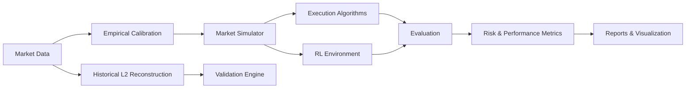

<h1 align="center">CleoLOB</h1>

<p align="center">
  <strong>A research-grade laboratory for limit order books, market microstructure, execution algorithms, and reinforcement learning.</strong>
</p>

<p align="center">
  CleoLOB provides a reproducible environment for simulating, reconstructing, calibrating, and analyzing limit order book markets — from synthetic experiments to historical L2 market data.
</p>

<p align="center">
  <a href="https://github.com/damraka/CleoLOB/actions/workflows/research.yml"></a>
  
  
  
  
</p>

<p align="center">
  
</p>

---

## Overview

CleoLOB is an open-source quantitative research platform for studying modern electronic markets.
It combines a configurable limit order book simulator with historical market-data reconstruction, empirical calibration, execution algorithms, reinforcement-learning environments, risk analysis, and interactive visualization.
The project is designed for research into questions such as:

- How do execution strategies behave under different market regimes?
- How accurately can historical L2 order books be reconstructed?
- How does order-book imbalance relate to short-term market dynamics?
- How do classical execution algorithms compare with learned policies?
- How sensitive are strategies to latency, impact, liquidity, fees, and market structure?
- Can simulated market dynamics reproduce empirical characteristics observed in real markets?

> **CleoLOB is a research and experimentation framework, not a production trading system.**

---

## Core Capabilities

| Area | Capabilities |
|---|---|
| Limit Order Book | Event-driven matching, bids/asks, market and limit orders |
| Market Simulation | Configurable synthetic order-flow environments |
| Historical Data | L2 reconstruction and snapshot validation |
| Calibration | Empirical parameter estimation from market data |
| Execution | TWAP, VWAP, POV, Almgren-Chriss and configurable policies |
| Reinforcement Learning | Execution environments and trainable agents |
| Risk | Execution cost, slippage, inventory and impact analysis |
| Research | Reproducible experiments, seeds, configs and reporting |
| Visualization | Interactive market-microstructure dashboards |

---

## Architecture



<p align="center">
  
</p>

## Empirical Validation

CleoLOB has been evaluated against historical Deribit ETH-PERPETUAL
Level-2 market data using both exact order-book reconstruction checks and
chronological out-of-sample calibration diagnostics.

### Historical L2 Reconstruction

A full approximately 24-hour incremental L2 stream was replayed and compared
against published top-five book snapshots.

| Metric | Result |
|---|---:|
| Exchange | Deribit |
| Instrument | ETH-PERPETUAL |
| Observed period | 23.9999 hours |
| Incremental L2 rows processed | 2,321,160 |
| Reconstructed book states | 1,531,713 |
| Published top-5 snapshots compared | 988,235 |
| Exact top-5 matches | 988,235 / 988,235 |
| Reconstruction match rate | **100.000%** |
| Different reconstructed books | 0 |
| Exchange timestamp mismatches | 0 |
| Crossed book groups | 0 |
| Missing level deletes | 0 |
| Trade records checked | 17,288 |

The reconstructed book matched every published top-five reference snapshot
in the evaluated dataset.

> This is a reconstruction-consistency check against snapshots from the same market-data source. It should not be interpreted as independent verification of exchange truth.

### End-to-End Assessment Performance

Measured locally while running the complete historical assessment pipeline. These numbers include the full `assess-l2` workflow and are not an isolated matching-engine benchmark.

| Metric | Result |
|---|---:|
| Total runtime | 111.06 s |
| Effective L2 throughput | ~20,900 rows/s |
| Effective reconstructed-state throughput | ~13,792 states/s |
| Platform | Windows 11 / AMD64 |
| Python | CPython 3.14.6 |

### Observed Market Statistics

Statistics were sampled on a one-second UTC grid using the latest completed
captured book.

| Metric | Mean | Median | 95th percentile |
|---|---:|---:|---:|
| Mid price | 131.814 | 131.975 | 133.925 |
| Spread | 4.172 bps | 3.790 bps | 7.579 bps |
| Bid depth (top 5, native units) | 239,902 | 242,820 | 354,902 |
| Ask depth (top 5, native units) | 241,855 | 244,314 | 342,629 |
| Top-5 imbalance | -0.00944 | -0.00092 | 0.38666 |

### Chronological Calibration Diagnostics

A fitted observable model was trained on earlier April 2020 data and frozen
before validation, internal testing, and later-date evaluation.
The study uses ordered, disjoint samples with purging / embargo rather than
random train-test splitting.

| Split | Samples | Diagnostic Status |
|---|---:|---|
| Training | 51,778 | Fit |
| Validation | 17,219 | WARNING |
| Internal test | 17,279 | FAIL |
| Later-date May test | 86,399 | FAIL |

A completed calibration study is not treated as evidence that the fitted
distribution generalizes to future market regimes.

### Later-Date Distribution Drift

The May 2020 holdout exhibited substantial drift relative to the April
training regime, particularly in quoted depth and spread.

| Observable | Train Mean | May Mean | Coverage | Normalized Distance | Status |
|---|---:|---:|---:|---:|---|
| Ask depth (top 5) | 254,266 | 109,161 | 32.6% | 1.703 | FAIL |
| Bid depth (top 5) | 233,046 | 90,984 | 34.4% | 1.246 | FAIL |
| Imbalance (top 5) | -0.0522 | -0.0823 | 83.2% | 0.186 | WARNING |
| Log return | ~0 | ~0 | 88.4% | 0.350 | WARNING |
| Spread | 4.071 bps | 2.977 bps | 20.4% | 1.282 | FAIL |

Rather than treating the later-date regime as a successful calibration,
CleoLOB reports the deterioration explicitly as an out-of-sample
generalization failure.

### Purged Expanding Walk-Forward Diagnostics

Four expanding-window folds were used to evaluate within-training-period
stability.

| Fold | Training Rows | Holdout Rows | Status |
|---|---:|---:|---|
| 1 | 25,828 | 6,471 | WARNING |
| 2 | 32,300 | 6,471 | FAIL |
| 3 | 38,772 | 6,471 | WARNING |
| 4 | 45,244 | 6,471 | WARNING |

#### Fold-level observables

| Fold | Ask Depth | Bid Depth | Imbalance | Log Return | Spread |
|---|---|---|---|---|---|
| 1 | WARNING | WARNING | WARNING | PASS | WARNING |
| 2 | FAIL | WARNING | FAIL | PASS | PASS |
| 3 | WARNING | WARNING | WARNING | PASS | PASS |
| 4 | PASS | PASS | PASS | PASS | WARNING |

Fold 2 was rejected primarily because the normalized distribution distances
for ask depth and imbalance exceeded the configured failure threshold.
By Fold 4, depth, imbalance, and log-return diagnostics passed, while spread
remained a warning-level diagnostic.

### Scope and Limitations

- L2 data does not expose individual order IDs or FIFO queue position.
- Hidden liquidity and hypothetical counterfactual fills cannot be recovered

  from aggregate L2 data.

- Depth remains in dataset-native units unless explicitly converted.
- Calibration thresholds are diagnostic heuristics, not statistical

  significance tests.

- Empirical reconstruction and calibration results do not establish strategy

  profitability.

- Historical replay validation and synthetic strategy evaluation are reported

  separately.


## Highlights

|                               |                                                                                |
| ----------------------------- | ------------------------------------------------------------------------------ |
| **521 tests**                 | Integrated unit, randomized-invariant, integration and regression suite        |
| **5,972,671**                 | Real Deribit L2 updates processed across the included April/May validation samples                                              |
| **2,081,479**                 | Top-five order-book snapshots matched exactly across the included public validation samples                                  |
| **46,195**                    | Public trade records checked across the included public validation samples                                                   |
| **Deterministic experiments** | Separate random streams, persistent clocks and reproducible run manifests      |
| **Execution research**        | TWAP, VWAP, POV, Almgren–Chriss, heuristics, random policies and PPO interface |
| **Statistical inference**     | Paired bootstrap, exact sign tests and multiple-testing correction             |
| **Historical reconstruction** | Exact event replay without inventing counterfactual fills                      |

CleoLOB combines a deterministic synthetic exchange with real-market reconstruction and research infrastructure designed to make experiments **auditable, reproducible and difficult to accidentally overstate**.


---

## What CleoLOB Is

CleoLOB is intended for research into:

* limit-order-book mechanics,
* optimal execution,
* market microstructure,
* execution cost and risk,
* reinforcement-learning execution agents,
* historical L2 reconstruction,
* calibration and walk-forward validation,
* stress testing,
* portfolio exposure,
* and reproducible strategy comparison.

It is **not** a live trading system.
There is no broker integration, real-money order submission, or claim of demonstrated live alpha.

---

## Research Philosophy

Market-microstructure experiments are extremely easy to overstate.
A strategy can appear profitable because of:

* unrealistic fills,
* unpriced residual inventory,
* look-ahead bias,
* inconsistent randomness,
* missing fees,
* survivorship of successful experiments,
* poorly calibrated synthetic order flow,
* or repeated hypothesis testing without correction.

CleoLOB is designed to expose these failure modes instead of hiding them.
The framework therefore treats experiment validity, provenance and failure reporting as first-class parts of the research process.

---

## Core Components

### Deterministic FIFO Exchange

The synthetic exchange supports:

* integer price ticks and order quantities,
* FIFO price-time priority,
* GTC orders,
* IOC orders,
* FOK orders,
* GTD orders,
* post-only orders,
* partial fills,
* cancellation,
* modification,
* conditional cancel/replace,
* explicit order states,
* queue positions,
* and invariant checks.

Persistent event clocks provide deterministic tie-breaking while separate random streams isolate independent sources of stochasticity.
Delayed messages and cancellation races are explicitly modeled.
Changing the observation frequency of a simulation does not change its underlying exogenous event path.

<p align="center">

  

</p>

---

### Execution Algorithms

Built-in execution strategies include:

* **TWAP**
* **synthetic-profile VWAP**
* **POV**
* **Almgren–Chriss**
* heuristic policies,
* random policies,
* and a Stable-Baselines3 **PPO** interface.

Registered research commands require an actual PPO checkpoint when PPO is selected, preventing an unavailable learned policy from silently falling back to another strategy.

---

### Accounting and Execution Risk

CleoLOB tracks:

* cash,
* signed inventory,
* average-cost PnL,
* realized execution effects,
* maker/taker fees,
* rebates,
* working orders,
* and in-flight reservations.

Risk controls include:

* child-order limits,
* position limits,
* notional limits,
* loss limits,
* conservative reservations,
* and a latched kill switch.

Outstanding orders are reconciled through a bounded post-horizon settlement phase.
Late fills and fees are included when they actually occur.
Unresolved orders can invalidate final economic metrics rather than being ignored.

---

## Real-Market L2 Reconstruction

CleoLOB includes a separate historical reconstruction pipeline for recorded market data.
Supported functionality includes:

* bounded CSV/JSONL ingestion,
* exact order IDs,
* snapshots,
* incremental events,
* source hashing,
* data-quality reports,
* pause/resume/reset,
* deterministic reconstruction,
* and stepwise replay.

Historical events are reconstructed separately from the synthetic matching engine so that recorded fills are not accidentally modified by synthetic exchange mechanics.

### Public L2 Validation

The public-data pipeline supports bounded Tardis samples with:

* download verification,
* gzip/checksum validation,
* exact decimal price handling,
* price-level reconstruction,
* snapshot comparison,
* trade checks,
* and causal one-second descriptive statistics.

A real-data validation study processed Deribit ETH perpetual samples from:

* **April 1, 2020**
* **May 1, 2020**

with the following results:

| Validation metric               |        Result |
| ------------------------------- | ------------: |
| L2 updates processed            | **5,972,671** |
| Top-five snapshots compared     | **2,081,479** |
| Exact top-five snapshot matches | **2,081,479** |
| Trades checked                  |    **46,195** |

This validates **aggregate historical reconstruction**.
It does **not** establish historical strategy profitability because aggregate L2 data alone does not identify the counterfactual queue position and fills that an unobserved strategy would have received.
See:

* [`examples/studies/historical/README.md`](examples/studies/historical/README.md)
* [`docs/public-market-data.md`](docs/public-market-data.md)

---

## Calibration and Validation

Historical observable models support:

* causal feature construction,
* frozen calibration artifacts,
* chronological train/test separation,
* purged splits,
* expanding walk-forward folds,
* later-date validation,
* drift diagnostics,
* coverage diagnostics,
* and deterministic observable generation.

Calibration artifacts can therefore be separated from later evaluation periods rather than allowing future information to leak backward into a study.
The current aggregate-L2 calibration layer does **not** identify queue-level arrival and cancellation dynamics.
The synthetic FIFO order-flow model should therefore not be interpreted as a fully calibrated representation of a real exchange.

---

## Reproducible Experiments

Every registered experiment can produce an isolated run directory containing evidence such as:

* normalized configuration,
* configuration hash,
* source snapshot,
* source hash,
* checkpoint identity,
* random seed manifest,
* episode outcomes,
* order logs,
* fill logs,
* risk events,
* validity information,
* statistics,
* and offline HTML reports.

Runs can be verified and compared rather than relying solely on final summary tables.
Example:

```bash
cleo reproduce examples/studies/foundation/20260913T191627-0268a8fa8cb3
cleo verify examples/studies/foundation/20260913T191627-0268a8fa8cb3
cleo experiment diff PATH_TO_FIRST_RUN PATH_TO_SECOND_RUN
```

Reproduction creates a new result directory.
It does not execute archived Python code or overwrite the original experiment.

---

## Statistical Research Design

CleoLOB includes tools for paired experimental designs and uncertainty-aware comparison.
Implemented methods include:

* paired bootstrap intervals,
* exact sign tests,
* Holm correction,
* Bonferroni correction,
* Benjamini–Hochberg correction,
* complete-pair validation,
* and bounded sampling of large finite parameter spaces.

Planned experiments that fail or produce economically unpriceable outcomes are retained.
If the required observations for a valid comparison do not exist, comparative inference can be withheld rather than calculated from a selectively surviving subset.

---

## Foundation Study

The included foundation study compares six baseline/heuristic execution policies using ten paired seeds:
**60 total episodes**
with:

* 2,000-share sell orders,
* 10-second horizons,
* 1 bps taker fees,
* full run evidence,
* configuration snapshots,
* source identity,
* and audit logs.

No PPO or SAC comparison was run in this study.
Every candidate-minus-TWAP bootstrap interval contains zero, and all five Holm-adjusted sign-test p-values are `1.0`.
Therefore:

> **The foundation study does not establish that any tested strategy outperforms TWAP.**

The experiment was performed in one uncalibrated synthetic market and should not be interpreted as evidence of live trading performance.
See:
[`examples/studies/foundation/README.md`](examples/studies/foundation/README.md)
Older 100-seed results generated under different market mechanics are retained separately for provenance:
[`results/baselines-100seeds/`](results/baselines-100seeds/)
They are archived results, not validation of the current engine.

---

## Stress Testing

Registered stress families allow strategies to be evaluated across multiple controlled scenarios while preserving:

* source identity,
* model identity,
* configuration identity,
* complete outcome retention,
* and family-wide statistical correction.

This allows sensitivity analysis without treating every parameter variation as an unrelated experiment.
Example:

```bash
cleo stress --config configs/robustness.yaml
```

---

## Portfolio Risk

CleoLOB includes linear multi-asset portfolio accounting with support for:

* multiple currencies,
* joint asset/FX scenarios,
* conservative reservations,
* exposure limits,
* loss limits,
* and portfolio-level stress evaluation.

Example:

```bash
cleo portfolio --config configs/portfolio_example.json
```

The current implementation is a **linear portfolio risk framework**.
It is not a nonlinear derivatives pricing or Greeks engine.

---

## Main Modules

| Module                 | Responsibility                                    |
| ---------------------- | ------------------------------------------------- |
| `lob/engine.py`        | Order lifecycle, FIFO book and synthetic exchange |
| `lob/accounting.py`    | Cash, inventory, fees and PnL                     |
| `lob/risk.py`          | Execution limits and reservations                 |
| `lob/execution.py`     | Execution strategies                              |
| `lob/rl_env.py`        | Reinforcement-learning environment                |
| `lob/runner.py`        | Simulation and strategy orchestration             |
| `lob/replay/`          | Historical schemas, validation and reconstruction |
| `lob/config.py`        | Strict research configuration                     |
| `configs/`             | Reusable experiment presets                       |
| `lob/experiments/`     | Experiment provenance and registry                |
| `lob/stats.py`         | Statistical comparison                            |
| `lob/cli.py`           | Research command-line interface                   |
| `lob/benchmarks.py`    | Matching microbenchmarks                          |
| `server.py`, `static/` | FastAPI / Three.js exploration interface          |
| `app.py`               | Legacy Streamlit exploration interface            |
| `tests/`               | Unit, invariant, integration and regression tests |

Correctness is currently prioritized over acceleration.
No Rust, C++, GPU or low-latency production performance claim is made.

---

## Installation

CleoLOB requires **Python 3.11+**.
Clone the repository:

```bash
git clone https://github.com/damraka/CleoLOB.git
cd CleoLOB
```

Create a virtual environment:

### Linux / macOS

```bash
python -m venv .venv
source .venv/bin/activate
```

### Windows PowerShell

```powershell
python -m venv .venv
.\.venv\Scripts\Activate.ps1
```

Install the core development environment:

```bash
python -m pip install -e '.[dev]'
```

Install the optional RL and web components:

```bash
python -m pip install -e '.[dev,rl,web]'
```

---

## Quickstart

Run the test suite:

```bash
python -m pytest -q
```

Validate a research configuration:

```bash
cleo config validate configs/research.yaml
```

Run an evaluation:

```bash
cleo evaluate --config configs/research.yaml
```

Validate historical events:

```bash
cleo validate-data examples/data/canonical-events.jsonl
```

Replay them:

```bash
cleo replay examples/data/canonical-events.jsonl
```

Run the matching benchmark:

```bash
cleo benchmark --pairs 2000 --repeats 3
```

Run registered stress scenarios:

```bash
cleo stress --config configs/robustness.yaml
```

Run a portfolio-risk example:

```bash
cleo portfolio --config configs/portfolio_example.json
```

`python -m lob.cli` is equivalent to the `cleo` command.
The original standalone demonstration remains available through:

```bash
python -m lob
```

---

## Web Visualization

CleoLOB retains both its FastAPI/Three.js interface and its original Streamlit dashboard.
Start the FastAPI application with:

```bash
python server.py --no-browser
```

Then open:

```text
http://127.0.0.1:8000
```

The web application is intended primarily for **exploration and visualization**.
Registered research experiments use the stricter CLI workflow and immutable experiment records.

---

## Configuration

Research configuration uses typed YAML/JSON with support for:

* strict validation,
* inheritance,
* environment overrides,
* CLI overrides,
* schema export,
* normalized hashing,
* and configuration diffs.

The experiment configuration is part of the evidence record rather than an implicit collection of runtime parameters.
Example:

```bash
cleo config validate configs/research.yaml
```

---

## Economic Validity

CleoLOB distinguishes actual execution from hypothetical residual valuation.
`effective_bps` includes:

* actual fill costs,
* and hypothetical terminal liquidation costs/fees,

only when sufficient depth exists to price the remaining quantity.
It does **not** include the separate RL completion penalty.
If residual inventory cannot be economically priced, the metric becomes null and the episode is marked **INVALID**.
A hypothetical mark or terminal liquidation is never recorded as an actual fill.
This prevents unfinished execution from appearing artificially profitable simply because remaining inventory disappeared at the end of an episode.

---

## Current Limitations

CleoLOB deliberately documents what it does **not** currently establish.

### Historical strategy performance

Historical L2 reconstruction is implemented and validated, but counterfactual historical execution is not yet established.
Aggregate L2 data does not uniquely determine:

* queue position,
* hidden liquidity,
* strategy-induced market response,
* or the fills an unobserved agent would have received.

Therefore the repository currently makes **no historical alpha claim**.

### Synthetic order flow

The FIFO exchange mechanics are explicit and tested, but the queue-level synthetic order-flow model remains uncalibrated.
Historical aggregate L2 calibration does not by itself identify queue-level arrival/cancellation processes.

### Latency

Message latency is modeled.
Full market-data dissemination latency is not.

### Reinforcement learning

A Stable-Baselines3 PPO interface is available.
The project currently does not claim a completed PPO-vs-baseline result establishing superiority.
SAC is not implemented.

### Market coverage

The project does not currently provide:

* an exchange-native production feed adapter,
* a complete outage engine,
* a complete flash-crash model,
* nonlinear derivatives portfolio risk,
* or production live-trading connectivity.

---

## Verification

The integrated project suite currently passes:

* **521 automated tests**
* Ruff checks
* Python compilation

CI is configured on Ubuntu for:

* Python **3.11**
* Python **3.12**

The current matching benchmark is a local **matching-engine microbenchmark**.
It should not be interpreted as full simulation throughput or production exchange performance.

---

## Documentation

Detailed documentation is available in:

* [Architecture audit](docs/architecture.md)
* [Configuration, CLI and provenance](docs/configuration.md)
* [Historical replay](docs/historical-replay.md)
* [Public L2 data and validation](docs/public-market-data.md)
* [Calibration, stress, settlement and portfolio workflows](docs/validation-and-risk.md)
* [Research methodology and limitations](docs/research-methodology.md)
* [Implementation status](docs/implementation-status.md)

Executed validation evidence:

* [`examples/studies/validation/README.md`](examples/studies/validation/README.md)

Foundation study:

* [`examples/studies/foundation/README.md`](examples/studies/foundation/README.md)

Historical validation:

* [`examples/studies/historical/README.md`](examples/studies/historical/README.md)

---

## Historical Market Data

CleoLOB supports experiments based on historical L2 market data.
A typical workflow is:

```text
Raw exchange data
        ↓
Parsing and validation
        ↓
Incremental L2 reconstruction
        ↓
Published snapshot comparison
        ↓
Empirical calibration
        ↓
Simulation / research experiments
        ↓
Evaluation and reporting
```

Historical data and simulation results are intentionally separated so that
synthetic experiments are not presented as empirical market evidence.
See the documentation for supported datasets and validation methodology.

## Roadmap

### Historical execution

- [ ] Historical event-replay execution engine
- [ ] Counterfactual order insertion
- [ ] Queue-position estimation
- [ ] Conservative / neutral / optimistic fill models

### Market realism

- [ ] Latency models
- [ ] Maker/taker fee models
- [ ] Improved market-impact calibration
- [ ] Additional market regimes

### Data

- [ ] Additional exchanges
- [ ] Additional instruments
- [ ] L3 / order-level datasets
- [ ] Longer multi-day validation datasets

### Research

- [ ] TWAP / VWAP / POV / Almgren-Chriss benchmark suite
- [ ] RL vs classical execution experiments
- [ ] Bootstrap confidence intervals
- [ ] Regime-conditioned evaluation
- [ ] Reproducible benchmark datasets

### Infrastructure

- [ ] Expanded CI benchmarks
- [ ] Performance profiling
- [ ] Experiment registry
- [ ] Improved documentation

## Project Status

CleoLOB is an active research project.
The framework currently provides substantial infrastructure for:
**simulation → execution → accounting → risk → replay → calibration → experiments → statistics → verification**
but it should still be treated as a research environment rather than a production trading system.

---

## Disclaimer

CleoLOB is provided for research and educational purposes.
Nothing in this repository constitutes investment advice, a recommendation to trade, or evidence of future trading performance.


## License

CleoLOB is licensed under the GNU Lesser General Public License v3.0 or later (LGPL-3.0-or-later). See [`LICENSE`](LICENSE) for the full terms.

