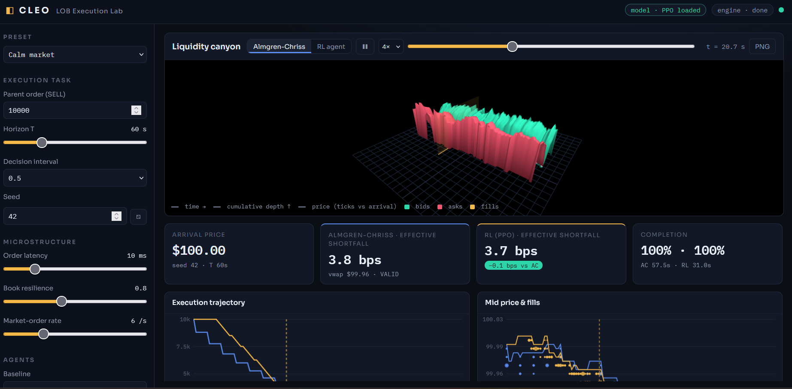

<h1 align="center">CleoLOB</h1>

<p align="center"><strong>Reproducible market-microstructure and execution research.</strong></p>

<p align="center">
CleoLOB studies execution strategies under explicit constraints around historical reconstruction,
calibration, queue observability, incomplete execution, and out-of-sample evaluation.
</p>

<p align="center">
  <a href="https://github.com/damraka/CleoLOB/actions/workflows/ci.yml"></a>
  <a href="https://github.com/damraka/CleoLOB/actions/workflows/research.yml"></a>
  
  
  
</p>

<p align="center">
  
</p>

## What it is

CleoLOB is an open-source quantitative research platform for limit order books, historical replay,
execution algorithms, empirical calibration, reinforcement learning, and reproducible experiments.

Its design goal is simple: make invalid assumptions, incomplete fills, data leakage, and selective
reporting harder to mistake for evidence.

It is a research framework, not a production trading system.

## Current evidence

| Question | Current result |
|---|---|
| Historical L2 reconstruction | On the registered Deribit datasets, 5,972,671 L2 updates and 2,081,479 published top-five snapshots were processed; all compared top-five snapshots matched exactly. |
| Real queue / order-identity research | Implemented at the MBO layer, but real historical MBO validation is still pending. |
| Cross-regime calibration | Not established. The registered shifted external evaluation fails its acceptance threshold. |
| PPO / DQN superiority | Not established. All 48 multiplicity-adjusted intervals in the registered v0.3 study include zero. |
| Incomplete execution | Actual fills and hypothetical residual liquidation are reported separately. |
| Performance | Local Python research benchmarks only; no production/HFT latency claim. |

Negative results are retained rather than removed from the research record.

## Core capabilities

- deterministic FIFO synthetic exchange with limit/market orders, partial fills, cancellation and modification
- historical aggregate-L2 reconstruction and snapshot validation
- identity-preserving MBO replay with queue trajectories and priority-reset handling
- chronological calibration with rolling/expanding validation and sealed holdouts
- TWAP, VWAP, POV, Almgren-Chriss and heuristic execution controls
- Stable-Baselines3 PPO and discrete-action DQN research workflows
- paired bootstrap and multiple-comparison correction
- experiment provenance, hashes and artifact verification
- risk, settlement and residual-inventory accounting
- FastAPI/Three.js and Streamlit exploration interfaces

## Quick start

Requires **Python 3.11+**.

```bash
git clone https://github.com/damraka/CleoLOB.git
cd CleoLOB
python -m venv .venv
```

Linux/macOS:

```bash
source .venv/bin/activate
```

Windows PowerShell:

```powershell
.\.venv\Scripts\Activate.ps1
```

Install the development environment:

```bash
python -m pip install -e '.[dev]'
```

Optional RL and web dependencies:

```bash
python -m pip install -e '.[dev,rl,web]'
```

Verify:

```bash
python -m pytest -q
cleo --help
```

Example commands:

```bash
cleo config validate configs/research.yaml
cleo validate-data examples/data/canonical-events.jsonl
cleo replay examples/data/canonical-events.jsonl
cleo benchmark --pairs 2000 --repeats 3
```

See [docs/reproduction.md](docs/reproduction.md) for the full reproduction workflow.

## Historical reconstruction

CleoLOB has been evaluated against public Deribit ETH-PERPETUAL Level-2 data.

Across the preserved April/May validation samples:

| Metric | Result |
|---|---:|
| L2 updates processed | 5,972,671 |
| Published top-five snapshots compared | 2,081,479 |
| Exact top-five matches | 2,081,479 |
| Trades checked | 46,195 |

One registered approximately 24-hour April stream contained 2,321,160 incremental rows,
1,531,713 reconstructed states and 988,235 exact top-five snapshot matches.

This demonstrates reconstruction consistency with published source snapshots. It does not establish
exchange truth, hidden liquidity, passive-fill counterfactuals or strategy profitability.

See [historical validation](examples/studies/historical/README.md) and
[public market-data documentation](docs/public-market-data.md).

## MBO and queue research

Aggregate L2 does not reveal individual order identities or exact FIFO queue positions, so CleoLOB
keeps L2 and MBO evidence separate.

The MBO layer supports source order identities, ADD/MODIFY/CANCEL/EXECUTE events, deterministic
replay, queue-ahead tracking, priority resets, observed maker executions, censoring and exact
MBO-to-L2 aggregation.

The bundled MBO fixtures are synthetic. **Real historical MBO validation is still pending.**

See [docs/mbo.md](docs/mbo.md).

## Calibration

The v0.3 calibration workflow uses chronological rather than random train/test evaluation and
supports causal features, frozen selection, expanding/rolling validation, sealed internal
evaluation, external evaluation and drift diagnostics.

The registered shifted external evaluation fails its configured acceptance gate. CleoLOB therefore
does not currently claim that its calibrated synthetic market generalizes to unseen real-market
regimes.

See [docs/calibration-v03.md](docs/calibration-v03.md).

## Execution and reinforcement learning

The registered v0.3 PPO/DQN study used independent training seeds, unseen evaluation seeds, common
market seeds, three regimes, six controls and finite ablations.

It completed **18 trained models**, **18,432 training steps** and **576 evaluation episodes**.
All **48/48** multiplicity-adjusted cost intervals include zero, so the study does not establish
learned-policy superiority.

DQN also showed poor completion in the registered study. Remaining inventory is valued separately
and is never converted into an actual fill.

See [docs/rl-v03.md](docs/rl-v03.md).

## Reproducibility

Registered experiments can retain normalized configuration, source identity and hashes,
model/checkpoint identity, random seeds, outcomes, validity status and statistical results.

Committed v0.3 artifacts can be verified with:

```bash
cleo verify-artifact examples/studies/v03
```

The v0.3 release passed local validation and cross-platform GitHub CI on Windows/Linux with
Python 3.11-3.14.

## Limitations

CleoLOB does not currently establish:

- real historical MBO queue validity
- hidden liquidity
- exact passive-fill counterfactuals from aggregate L2
- successful cross-regime simulator calibration
- PPO/DQN superiority
- live alpha or profitability
- production HFT or exchange-colocated performance

These are explicit research boundaries rather than hidden assumptions.

## Roadmap

v0.4 focuses on stronger external validity and real-market evidence, including real historical MBO,
formal market-data capability contracts, fresh multi-period holdouts, calibration failure attribution,
completion-aware policies, stronger registered RL studies, scaling analysis and independent reproduction.

See the full [v0.4 roadmap](docs/v04-roadmap.md).

## Documentation

- [Architecture](docs/architecture.md)
- [MBO semantics](docs/mbo.md)
- [Public market data](docs/public-market-data.md)
- [v0.3 calibration protocol](docs/calibration-v03.md)
- [v0.3 RL protocol](docs/rl-v03.md)
- [Research methodology](docs/research-methodology.md)
- [Reproduction guide](docs/reproduction.md)
- [v0.3 final report](docs/v03-final-report.md)
- [v0.4 roadmap](docs/v04-roadmap.md)

## Citation

Academic users can use the metadata in [`CITATION.cff`](CITATION.cff).

## License

CleoLOB is licensed under the **GNU Lesser General Public License v3.0 or later (LGPL-3.0-or-later)**.

## Disclaimer

CleoLOB is provided for research and educational purposes. Nothing in this repository constitutes
investment advice, a recommendation to trade, or evidence of future trading performance.
