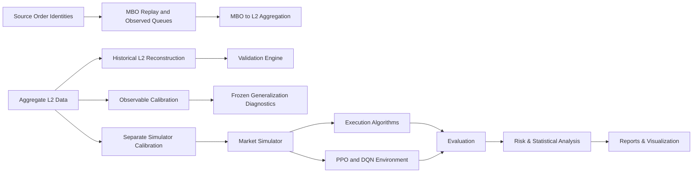
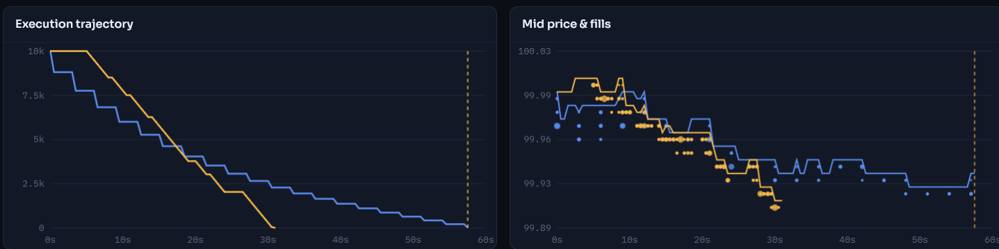
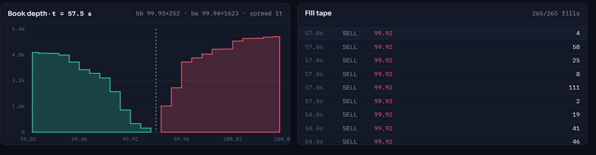

<h1 align="center">CleoLOB</h1>

<p align="center">
  <strong>A research laboratory for limit order books, market microstructure, execution algorithms, and reinforcement learning.</strong>
</p>

<p align="center">
  CleoLOB provides a reproducible environment for simulating, reconstructing, calibrating, and analyzing limit order book markets — from synthetic experiments to historical L2 market data.
</p>

<p align="center">
  <a href="https://github.com/damraka/CleoLOB/actions/workflows/research.yml"></a>
  
  
  
  
</p>

<p align="center">
  
</p>

---

## Overview

CleoLOB is an open-source quantitative research platform for studying modern electronic markets.

It combines a configurable limit order book simulator with historical market-data reconstruction, empirical calibration, execution algorithms, reinforcement-learning environments, risk analysis, statistical comparison, and interactive visualization.

The project is designed for research into questions such as:

- How do execution strategies behave under different market regimes?
- How accurately can historical L2 order books be reconstructed?
- How does order-book imbalance relate to short-term market dynamics?
- How do classical execution algorithms compare with learned policies?
- How sensitive are strategies to latency, impact, liquidity, fees, and market structure?
- Can simulated market dynamics reproduce empirical characteristics observed in real markets?

> **CleoLOB is a research and experimentation framework, not a production trading system.**

## Highlights

| Evidence / capability | Current state |
|---|---|
| **Automated verification** | TESTED: 700 passed on local Python 3.14; isolated Python 3.11/3.12/3.13 core runs each passed 691 with 9 optional-RL skips; details in the [v0.3 report](docs/v03-final-report.md) |
| **5,972,671 real L2 updates** | EMPIRICALLY OBSERVED: processed across the preserved April/May Deribit validation samples |
| **2,081,479 exact top-five matches** | EMPIRICALLY OBSERVED: published top-five snapshots matched across those samples |
| **46,195 public trades checked** | EMPIRICALLY OBSERVED: trade records checked across those samples |
| **MBO identity research** | IMPLEMENTED / TESTED: bounded order-level replay, observed queues and deterministic L2 aggregation; real MBO validation remains pending |
| **Calibration generalization** | IMPLEMENTED / TESTED: IID and spread-state Markov observable models, expanding/rolling validation and sealed external evaluation; prior historical WARNING/FAIL results preserved |
| **Execution research** | IMPLEMENTED / TESTED: PPO and discrete-action DQN studies with six classical/diagnostic controls, paired seeds, regime shifts and finite ablations |
| **Performance measurements** | IMPLEMENTED / TESTED: warm repeated L2/MBO/book/snapshot/replay/episode workloads, latency percentiles, separate Python-allocation measurements and provenance |

Claims use **IMPLEMENTED** for runnable functionality, **TESTED** for checks of
specified behavior, **EMPIRICALLY OBSERVED** for a recorded study result,
**FAILED** for a retained failed diagnostic or experiment, **LIMITATION** for an
unsupported inference, and **PLANNED** for work not yet validated. Passing tests
does not establish market realism or policy superiority. Current v0.3 results,
commands and exclusions are recorded in the [final report](docs/v03-final-report.md).

CleoLOB is intentionally designed to make experiments **auditable, reproducible, and difficult to accidentally overstate**.

## Core Capabilities

| Area | Capabilities |
|---|---|
| Limit Order Book | Event-driven matching, FIFO price-time priority, market and limit orders |
| Market Simulation | Configurable synthetic order-flow environments and controlled scenarios |
| Historical Data | L2 reconstruction, snapshot validation, trade checks, and source hashing |
| MBO Research | Actual source IDs, snapshot FIFO contract, recorded maker executions, queue trajectories and censoring |
| Calibration | Causal observables, two model families, chronological selection, expanding/rolling folds and drift diagnostics |
| Execution | TWAP, VWAP, POV, Almgren–Chriss, heuristic policies, and configurable strategies |
| Reinforcement Learning | Audited execution environment, Stable-Baselines3 PPO/DQN and registered policy studies |
| Risk | Execution cost, slippage, inventory, reservations, fees, and exposure controls |
| Research | Reproducible experiments, provenance, statistical comparison, and audit artifacts |
| Performance | Profiled local research workloads, p50/p95/p99 latencies and bounded memory measurements |
| Visualization | FastAPI/Three.js and Streamlit exploration interfaces |

## Architecture



<p align="center">
  
  
</p>

---

## Quick Start

CleoLOB requires **Python 3.11+**.

### Clone and create an environment

```bash
git clone https://github.com/damraka/CleoLOB.git
cd CleoLOB
python -m venv .venv
```

Linux / macOS:

```bash
source .venv/bin/activate
```

Windows PowerShell:

```powershell
.\.venv\Scripts\Activate.ps1
```

### Install

Core development environment:

```bash
python -m pip install -e '.[dev]'
```

The [Linux-first reproduction guide](docs/reproduction.md) also provides a
one-command bootstrap, wheel checks, container instructions and a synthetic
end-to-end smoke dataset. Generated runs belong under ignored `results/` paths.

Optional RL and web components:

```bash
python -m pip install -e '.[dev,rl,web]'
```

### Verify the installation

```bash
python -m pytest -q
cleo --help
```

### Example research commands

```bash
cleo config validate configs/research.yaml
cleo evaluate --config configs/research.yaml
cleo validate-data examples/data/canonical-events.jsonl
cleo replay examples/data/canonical-events.jsonl
cleo benchmark --pairs 2000 --repeats 3
cleo stress --config configs/robustness.yaml
cleo portfolio --config configs/portfolio_example.json
```

`python -m lob.cli` is equivalent to the `cleo` command. The original standalone demonstration remains available through:

```bash
python -m lob
```

---

## Empirical Validation

**EMPIRICALLY OBSERVED — preserved historical studies:** CleoLOB has been evaluated
against historical Deribit ETH-PERPETUAL Level-2 market data using reconstruction
checks and chronological out-of-sample calibration diagnostics. The numerical
tables in this section describe the earlier studies, not new v0.3 measurements.

### Historical L2 Reconstruction

A full approximately 24-hour incremental L2 stream was replayed and compared against published top-five book snapshots.

| Metric | Result |
|---|---:|
| Exchange | Deribit |
| Instrument | ETH-PERPETUAL |
| Observed period | 23.9999 hours |
| Incremental L2 rows processed | 2,321,160 |
| Reconstructed book states | 1,531,713 |
| Published top-5 snapshots compared | 988,235 |
| Exact top-5 matches | 988,235 / 988,235 |
| Reconstruction match rate | **100.000%** |
| Different reconstructed books | 0 |
| Exchange timestamp mismatches | 0 |
| Crossed book groups | 0 |
| Missing level deletes | 0 |
| Trade records checked | 17,288 |

The reconstructed book matched every published top-five reference snapshot in the evaluated dataset.

> This is a reconstruction-consistency check against snapshots from the same market-data source. It should not be interpreted as independent verification of exchange truth.

### End-to-End Assessment Performance

Measured locally while running the complete historical assessment pipeline. These numbers include the full `assess-l2` workflow and are not an isolated matching-engine benchmark.

| Metric | Result |
|---|---:|
| Total runtime | 111.06 s |
| Effective L2 throughput | ~20,900 rows/s |
| Effective reconstructed-state throughput | ~13,792 states/s |
| Platform | Windows 11 / AMD64 |
| Python | CPython 3.14.6 |

The local benchmark environment is separate from the CI support matrix described below.

### Observed Market Statistics

Statistics were sampled on a one-second UTC grid using the latest completed captured book.

| Metric | Mean | Median | 95th percentile |
|---|---:|---:|---:|
| Mid price | 131.814 | 131.975 | 133.925 |
| Spread | 4.172 bps | 3.790 bps | 7.579 bps |
| Bid depth (top 5, native units) | 239,902 | 242,820 | 354,902 |
| Ask depth (top 5, native units) | 241,855 | 244,314 | 342,629 |
| Top-5 imbalance | -0.00944 | -0.00092 | 0.38666 |

### Chronological Calibration Diagnostics

A fitted observable model was trained on earlier April 2020 data and frozen before validation, internal testing, and later-date evaluation. The study uses ordered, disjoint samples with purging / embargo rather than random train-test splitting.

| Split | Samples | Diagnostic status |
|---|---:|---|
| Training | 51,778 | Fit |
| Validation | 17,219 | WARNING |
| Internal test | 17,279 | FAIL |
| Later-date May test | 86,399 | FAIL |

A completed calibration study is not treated as evidence that the fitted distribution generalizes to future market regimes. Here, `FAIL` means a configured diagnostic threshold was breached; it does **not** mean the calibration pipeline crashed or failed to execute.

### Later-Date Distribution Drift

The May 2020 holdout exhibited substantial drift relative to the April training regime, particularly in quoted depth and spread.

| Observable | Train mean | May mean | Coverage | Normalized distance | Status |
|---|---:|---:|---:|---:|---|
| Ask depth (top 5) | 254,266 | 109,161 | 32.6% | 1.703 | FAIL |
| Bid depth (top 5) | 233,046 | 90,984 | 34.4% | 1.246 | FAIL |
| Imbalance (top 5) | -0.0522 | -0.0823 | 83.2% | 0.186 | WARNING |
| Log return | ~0 | ~0 | 88.4% | 0.350 | WARNING |
| Spread | 4.071 bps | 2.977 bps | 20.4% | 1.282 | FAIL |

Rather than treating the later-date regime as a successful calibration, CleoLOB reports the deterioration explicitly as an out-of-sample generalization failure.

### Purged Expanding Walk-Forward Diagnostics

Four expanding-window folds were used to evaluate within-training-period stability.

| Fold | Training rows | Holdout rows | Status |
|---|---:|---:|---|
| 1 | 25,828 | 6,471 | WARNING |
| 2 | 32,300 | 6,471 | FAIL |
| 3 | 38,772 | 6,471 | WARNING |
| 4 | 45,244 | 6,471 | WARNING |

#### Fold-level observables

| Fold | Ask depth | Bid depth | Imbalance | Log return | Spread |
|---|---|---|---|---|---|
| 1 | WARNING | WARNING | WARNING | PASS | WARNING |
| 2 | FAIL | WARNING | FAIL | PASS | PASS |
| 3 | WARNING | WARNING | WARNING | PASS | PASS |
| 4 | PASS | PASS | PASS | PASS | WARNING |

Fold 2 was rejected primarily because the normalized distribution distances for ask depth and imbalance exceeded the configured failure threshold. By Fold 4, depth, imbalance, and log-return diagnostics passed, while spread remained a warning-level diagnostic.

### Scope of the empirical evidence

- L2 data does not expose individual order IDs or FIFO queue position.
- Hidden liquidity and hypothetical counterfactual fills cannot be recovered from aggregate L2 data.
- Depth remains in dataset-native units unless explicitly converted.
- Calibration thresholds are diagnostic heuristics, not statistical significance tests.
- Empirical reconstruction and calibration results do not establish strategy profitability.
- Historical replay validation and synthetic strategy evaluation are reported separately.

---

## Research Philosophy

Market-microstructure experiments are extremely easy to overstate. A strategy can appear profitable because of unrealistic fills, unpriced residual inventory, look-ahead bias, inconsistent randomness, missing fees, survivorship of successful experiments, poorly calibrated synthetic order flow, or repeated hypothesis testing without correction.

CleoLOB is designed to expose these failure modes instead of hiding them. Experiment validity, provenance, failure reporting, and reproducibility are treated as first-class parts of the research process.

## Core Components

### Deterministic FIFO Exchange

The synthetic exchange supports:

- integer price ticks and order quantities,
- FIFO price-time priority,
- GTC, IOC, FOK, and GTD orders,
- post-only orders,
- partial fills,
- cancellation and modification,
- conditional cancel/replace,
- explicit order states,
- queue positions,
- and invariant checks.

Persistent event clocks provide deterministic tie-breaking while separate random streams isolate independent sources of stochasticity. Delayed messages and cancellation races are explicitly modeled. Changing the observation frequency of a simulation does not change its underlying exogenous event path.

### Execution Algorithms

Built-in execution strategies include:

- **TWAP**,
- **synthetic-profile VWAP**,
- **POV**,
- **Almgren–Chriss**,
- heuristic policies,
- random policies,
- and Stable-Baselines3 **PPO** and **DQN** through the registered v0.3 study.

Registered research commands require an actual PPO checkpoint when PPO is selected, preventing an unavailable learned policy from silently falling back to another strategy.

### Accounting and Execution Risk

CleoLOB tracks cash, signed inventory, average-cost PnL, realized execution effects, maker/taker fees, rebates, working orders, and in-flight reservations.

Risk controls include child-order limits, position limits, notional limits, loss limits, conservative reservations, and a latched kill switch.

Outstanding orders are reconciled through a bounded post-horizon settlement phase. Late fills and fees are included when they actually occur. Unresolved orders can invalidate final economic metrics rather than being silently ignored.

---

## Historical Reconstruction and MBO Research

CleoLOB separates aggregate L2 reconstruction from canonical order-level replay.
The following order-level capabilities require identities supplied by a source;
they cannot be synthesized from aggregate price levels.

Supported functionality includes:

- bounded CSV/JSONL ingestion,
- schemas that preserve order IDs when the source data provides them,
- snapshots and incremental events,
- source hashing,
- data-quality reports,
- pause/resume/reset,
- deterministic reconstruction,
- and stepwise replay.

Historical events are reconstructed separately from the synthetic matching engine so that recorded data is not accidentally modified by synthetic exchange mechanics.

**IMPLEMENTED / TESTED:** `lob.mbo` wraps the existing identity-driven book with
strict MBO events, bounded JSONL/gzip replay, source/canonical hashes, queue
observations, cancellation ahead, recorded fill times and censored cohort
frequencies. `TRADE` prints do not become maker fills; `EXECUTE` requires the
recorded maker ID. Aggregate L2 explicitly refuses identity/FIFO capabilities.

**LIMITATION:** Both bundled order-level fixtures are synthetic. No real
historical MBO validation is claimed. Exact queues additionally require source
completeness and source-guaranteed snapshot priority. See [MBO semantics](docs/mbo.md).

### Public L2 Validation

The public-data pipeline supports bounded Tardis samples with download verification, gzip/checksum validation, exact decimal price handling, price-level reconstruction, snapshot comparison, trade checks, and causal one-second descriptive statistics.

Across the included Deribit ETH perpetual public validation samples from **April 1, 2020** and **May 1, 2020**:

| Validation metric | Result |
|---|---:|
| L2 updates processed | **5,972,671** |
| Top-five snapshots compared | **2,081,479** |
| Exact top-five snapshot matches | **2,081,479** |
| Trades checked | **46,195** |

This validates **aggregate historical reconstruction**. It does **not** establish historical strategy profitability because aggregate L2 data alone does not identify the counterfactual queue position and fills that an unobserved strategy would have received.

See:

- [`examples/studies/historical/README.md`](examples/studies/historical/README.md)
- [`docs/public-market-data.md`](docs/public-market-data.md)

### Historical-data workflow

```text
Raw exchange data
        ↓
Parsing and validation
        ↓
Incremental L2 reconstruction
        ↓
Published snapshot comparison
        ↓
Empirical calibration
        ↓
Simulation / research experiments
        ↓
Evaluation and reporting
```

Historical data and simulation results are intentionally separated so that synthetic experiments are not presented as empirical market evidence.

---

## Calibration and Validation

**IMPLEMENTED / TESTED:** Historical observable models support:

- causal feature construction,
- frozen calibration artifacts,
- chronological train/test separation,
- purged splits,
- expanding and rolling walk-forward folds,
- later-date validation,
- drift diagnostics,
- coverage diagnostics,
- and deterministic observable generation.

Calibration artifacts can therefore be separated from later evaluation periods rather than allowing future information to leak backward into a study.

The current aggregate-L2 calibration layer does **not** identify queue-level arrival and cancellation dynamics. The synthetic FIFO order-flow model should therefore not be interpreted as a fully calibrated representation of a real exchange.

The v0.3 workflow compares joint IID resampling with a two-state spread Markov
observable model. Family/window selection uses chronological validation only;
internal and external scores cannot alter the sealed selection. Eight observable
definitions, missing-data rules, loss contributions and predeclared gates are
documented in [the calibration protocol](docs/calibration-v03.md).

**FAILED:** The earlier April/May observable study retains WARNING/FAIL outcomes.
The separate July–September 2026 simulator calibration also retains
[all six failed external gates](examples/studies/core/calibration/EXTERNAL_RESULTS.md).
Those consumed periods cannot serve as new untouched holdouts. The v0.3 bundled
two-state dataset is a synthetic smoke fixture, not independent market validation.

**EMPIRICALLY OBSERVED / FAILED:** In the v0.3 smoke, validation selected
`spread_markov/expanding` with mean loss **0.163811**, versus **0.487916** for
`iid_joint/expanding`. The frozen model's internal test returned **WARNING**
(loss **0.290986**) and shifted external fixture returned **FAIL** (loss
**0.937720**). Better validation loss did not establish cross-regime validity;
the external result did not change the selection or thresholds.

## Reproducible Experiments

Every registered experiment can produce an isolated run directory containing evidence such as:

- normalized configuration and configuration hash,
- source snapshot and source hash,
- checkpoint identity,
- random seed manifest,
- episode outcomes,
- order and fill logs,
- risk events,
- validity information,
- statistics,
- and offline HTML reports.

Runs can be verified and compared rather than relying solely on final summary tables.

```bash
cleo reproduce examples/studies/foundation/20260913T191627-0268a8fa8cb3
cleo verify examples/studies/foundation/20260913T191627-0268a8fa8cb3
cleo experiment diff PATH_TO_FIRST_RUN PATH_TO_SECOND_RUN
```

Reproduction creates a new result directory. It does not execute archived Python code or overwrite the original experiment.

## Statistical Research Design

CleoLOB includes tools for paired experimental designs and uncertainty-aware comparison:

- paired bootstrap intervals,
- exact sign tests,
- Holm correction,
- Bonferroni correction,
- Benjamini–Hochberg correction,
- complete-pair validation,
- and bounded sampling of large finite parameter spaces.

Planned experiments that fail or produce economically unpriceable outcomes are retained. If the required observations for a valid comparison do not exist, comparative inference can be withheld rather than calculated from a selectively surviving subset.

## Foundation Study

The included foundation study compares six baseline/heuristic execution policies using ten paired seeds: **60 total episodes** with 2,000-share sell orders, 10-second horizons, 1 bps taker fees, full run evidence, configuration snapshots, source identity, and audit logs.

No PPO or SAC comparison was run in this study. Every candidate-minus-TWAP bootstrap interval contains zero, and all five Holm-adjusted sign-test p-values are `1.0`.

> **The foundation study does not establish that any tested strategy outperforms TWAP.**

The experiment was performed in one uncalibrated synthetic market and should not be interpreted as evidence of live trading performance.

See [`examples/studies/foundation/README.md`](examples/studies/foundation/README.md).

Older 100-seed results generated under different market mechanics are retained separately for provenance in [`results/baselines-100seeds/`](results/baselines-100seeds/). They are archived results, not validation of the current engine.

## Learned-Policy Studies

**EMPIRICALLY OBSERVED:** The preserved September 22 core study completed 20 PPO
fits and 704 final synthetic episodes with zero INVALID outcomes. Its primary
PPO-minus-risk-neutral-AC net-cost difference was −1.6046 bps, with a 95% interval
[−2.0951, −1.0152]. Actual primary fill was 86.90%; remaining inventory was
hypothetically valued. This is a bounded simulator result, conditional on failed
historical calibration gates, and establishes no historical execution edge or
live alpha. See the [retained result](examples/studies/core/ppo-final-20260922/result.json)
and [core evidence scope](examples/studies/core/README.md).

**IMPLEMENTED / TESTED:** The separate v0.3 protocol adds DQN for the environment's
five discrete actions, PPO, three independent training seeds, paired evaluation
on unseen seeds, original/shifted/stress regimes and observation/terminal-penalty
ablations. All six controls run on every regime/market seed. Its registered smoke
completed **18 fits / 18,432 training steps / 576 evaluation episodes**, with zero
INVALID or WARNING economic outcomes. All **48/48** multiplicity-adjusted cost
intervals include zero; this study does not establish policy superiority.

**FAILED — completion objective:** Main DQN completed **0%, 4.17%, 4.17%** of
original, shifted and stress episodes, leaving mean residual quantities of
**272.125, 205.375, 108.0833** out of 300. Main PPO completed 100% in each regime,
but its stress mean cost was **3.7378 bps**, versus TWAP **2.9858** and AC **3.4108**.
An economically priceable outcome is not necessarily a completed execution:
DQN's residuals are hypothetically valued, never recorded as fills. These
failures remain visible despite the successful pipeline execution.

Full results are in the [v0.3 report](docs/v03-final-report.md). The [RL protocol](docs/rl-v03.md)
defines the 48-comparison family, uncertainty, reward, observations and limitations.

## Stress Testing

Registered stress families allow strategies to be evaluated across multiple controlled scenarios while preserving source identity, model identity, configuration identity, complete outcome retention, and family-wide statistical correction.

```bash
cleo stress --config configs/robustness.yaml
```

## Portfolio Risk

CleoLOB includes linear multi-asset portfolio accounting with support for multiple currencies, joint asset/FX scenarios, conservative reservations, exposure limits, loss limits, and portfolio-level stress evaluation.

```bash
cleo portfolio --config configs/portfolio_example.json
```

The current implementation is a **linear portfolio risk framework**. It is not a nonlinear derivatives pricing or Greeks engine.

---

## Web Visualization

CleoLOB retains its FastAPI/Three.js interface and original Streamlit dashboard
in `app.py`. They are exploration interfaces, not registered study entry points.

Start the FastAPI application with:

```bash
python server.py --no-browser
```

Then open:

```text
http://127.0.0.1:8000
```

The web application is intended primarily for **exploration and visualization**. Registered research experiments use the stricter CLI workflow and immutable experiment records.

## Configuration

Research configuration uses typed YAML/JSON with support for strict validation, inheritance, environment overrides, CLI overrides, schema export, normalized hashing, and configuration diffs.

```bash
cleo config validate configs/research.yaml
```

The experiment configuration is part of the evidence record rather than an implicit collection of runtime parameters.

## Economic Validity

CleoLOB distinguishes actual execution from hypothetical residual valuation.

`effective_bps` includes actual fill costs and hypothetical terminal liquidation costs/fees only when sufficient depth exists to price the remaining quantity. It does **not** include the separate RL completion penalty.

If residual inventory cannot be economically priced, the metric becomes null and the episode is marked **INVALID**. A hypothetical mark or terminal liquidation is never recorded as an actual fill.

This prevents unfinished execution from appearing artificially profitable simply because remaining inventory disappeared at the end of an episode.

---

## Main Modules

| Module | Responsibility |
|---|---|
| `lob/engine.py` | Order lifecycle, FIFO book, and synthetic exchange |
| `lob/accounting.py` | Cash, inventory, fees, and PnL |
| `lob/risk.py` | Execution limits and reservations |
| `lob/execution.py` | Execution strategies |
| `lob/rl_env.py` | Reinforcement-learning environment |
| `lob/runner.py` | Simulation and strategy orchestration |
| `lob/replay/` | Historical schemas, validation, and reconstruction |
| `lob/mbo.py` | Bounded identity replay, queue metrics, censoring and exact L2 aggregation |
| `lob/generalization.py` | Chronological observable-model selection and holdout diagnostics |
| `lob/policy_study.py` | Registered PPO/DQN training, paired controls, ablations and evaluation |
| `lob/config.py` | Strict research configuration |
| `configs/` | Reusable experiment presets |
| `lob/experiments/` | Experiment provenance and registry |
| `lob/artifacts.py` | Portable provenance, hashes and compact evidence verification |
| `lob/stats.py` | Statistical comparison |
| `lob/cli.py` | Research command-line interface |
| `lob/benchmarks.py` | Matching microbenchmarks |
| `lob/performance.py` | Profiling, repeated workload benchmarks, latency distributions and memory |
| `server.py`, `static/` | FastAPI / Three.js exploration interface |
| `app.py` | Legacy Streamlit exploration interface |
| `tests/` | Unit, invariant, integration, and regression tests |

Correctness is currently prioritized over acceleration. No Rust, C++, GPU, or low-latency production-performance claim is made.


## Current Limitations

- CleoLOB is a young research project and has not yet accumulated substantial
  independent community validation or external reproductions.

- Historical validation currently operates on aggregate Level-2 data rather
  than full market-by-order feeds. Order identity, exact FIFO queue position,
  hidden liquidity, and historical passive-fill counterfactuals therefore
  cannot be reconstructed exactly.

- The reinforcement-learning layer supports bounded PPO execution studies,
  discrete-action DQN and a registered smoke comparison, but CleoLOB should not be interpreted as a library of production-ready or
  state-of-the-art execution agents.

- Observable and simulator calibration have failed historical cross-regime
  diagnostics. Those failures remain visible. Synthetic smoke results cannot
  override them, and previously inspected holdouts cannot be reused as fresh evidence.

- No live alpha, live profitability or independent execution superiority has
  been demonstrated. Hypothetical residual valuation is separate from actual fills.

- Reported historical-processing throughput is an end-to-end local benchmark,
  not a production low-latency or exchange-colocation benchmark.

### Historical strategy performance

Historical L2 reconstruction is implemented and validated, but counterfactual historical execution is not yet established. Aggregate L2 data does not uniquely determine queue position, hidden liquidity, strategy-induced market response, or the fills an unobserved agent would have received.

Therefore, the repository currently makes **no historical alpha claim**.

### Synthetic order flow

The FIFO exchange mechanics are explicit and tested. Simulation-based fitting
exists, but the model failed its external gates and remains empirically
unvalidated. Historical aggregate L2 calibration does not identify queue-level
arrival/cancellation processes.

### Latency

Message latency is modeled. Full market-data dissemination latency is not.

### Reinforcement learning

The completed core PPO comparison is limited to its declared synthetic design.
The new PPO/DQN study broadens controls and regimes; its small training budget
cannot establish convergence or algorithm superiority. SAC is not implemented;
the current action space is discrete. A historically calibrated execution regime
is unavailable while the calibration gates fail.

### Market coverage

The project does not currently provide an exchange-native production feed adapter, a complete outage engine, a complete flash-crash model, nonlinear derivatives portfolio risk, or production live-trading connectivity.

---

## Verification

The exact final Ruff, compilation, full pytest, dependency, wheel and CLI checks
are recorded in the [v0.3 validation report](docs/v03-final-report.md). Historical
test counts in dated documents describe their original commits.

**TESTED locally:** Python 3.14 completed **700 passed, 2 warnings**. Isolated
Python 3.11, 3.12 and 3.13 environments each completed **691 passed, 9 skipped,
2 warnings**; those skips concern optional RL dependencies. The two warnings
concern the existing unbounded Gymnasium observation Box. These local results
do not certify a remote CI run.

The [research CI workflow](.github/workflows/research.yml) defines the supported
test matrix and the separate RL dependency job. Configuring a workflow does not
establish that its remote run passed; local and remote checks are reported separately.

**IMPLEMENTED / TESTED:** `lob.performance` reports warm repeated small/medium/deep
workloads, p50/p95/p99, operations per second, replay/episode throughput and Python
allocations, with OS/Python/CPU/package/source identity. Timer and scheduling costs
are included; Python allocations are not process RSS. No speedup or production
latency follows merely from having a benchmark suite.

## Documentation

Detailed documentation:

- [Architecture audit](docs/architecture.md)
- [Configuration, CLI and provenance](docs/configuration.md)
- [Historical replay](docs/historical-replay.md)
- [MBO research and synthetic validation](docs/mbo.md)
- [Public L2 data and validation](docs/public-market-data.md)
- [Calibration, stress, settlement and portfolio workflows](docs/validation-and-risk.md)
- [v0.3 calibration methodology](docs/calibration-v03.md)
- [v0.3 RL protocol and environment audit](docs/rl-v03.md)
- [Independent reproduction](docs/reproduction.md)
- [v0.3 final results and acceptance report](docs/v03-final-report.md)
- [Research methodology and limitations](docs/research-methodology.md)
- [Implementation status](docs/implementation-status.md)

Executed evidence:

- [Validation evidence](examples/studies/validation/README.md)
- [Foundation study](examples/studies/foundation/README.md)
- [Historical validation](examples/studies/historical/README.md)

## Roadmap

**PLANNED:** The remaining items below are extensions beyond the bounded,
implemented v0.3 workflows.

### Historical execution

- [ ] Validated exchange-native MBO adapter
- [ ] Counterfactual order insertion
- [ ] Independently validated queue studies on actual MBO data
- [ ] Conservative / neutral / optimistic fill models

### Market realism

- [ ] Latency-model extensions
- [ ] Improved market-impact calibration
- [ ] Empirically validated market regimes beyond synthetic shifts

### Data

- [ ] Additional exchanges
- [ ] Additional instruments
- [ ] L3 / order-level datasets
- [ ] Longer multi-day validation datasets

### Research

- [ ] Expanded TWAP / VWAP / POV / Almgren–Chriss benchmark studies
- [ ] Longer-budget PPO/DQN studies with more independent training seeds
- [ ] Independent real-market generalization with fresh holdouts
- [ ] Licensed MBO benchmark datasets

### Infrastructure

- [ ] Expanded CI benchmarks
- [ ] Profile-supported optimization with equivalence evidence
- [ ] Improved experiment registry and reporting
- [ ] Expanded documentation

---

## Citation

If you use CleoLOB in academic work, use the repository citation metadata in [`CITATION.cff`](CITATION.cff).

## License

CleoLOB is licensed under the **GNU Lesser General Public License v3.0 or later (LGPL-3.0-or-later)**. See [`LICENSE`](LICENSE) for the full terms.

## Disclaimer

CleoLOB is provided for research and educational purposes. Nothing in this repository constitutes investment advice, a recommendation to trade, or evidence of future trading performance.
