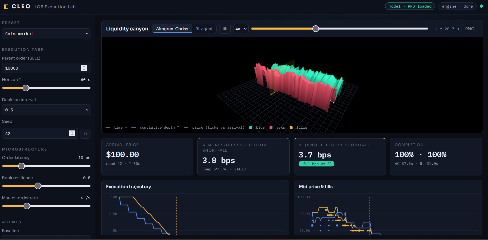

<h1 align="center">CleoLOB</h1>

<p align="center">
  <strong>Reproducible market-microstructure and execution research.</strong>
</p>

<p align="center">
  CleoLOB studies execution strategies under explicit constraints around historical reconstruction,
  calibration, queue observability, incomplete execution, and out-of-sample evaluation.
</p>

<p align="center">
  <a href="https://github.com/damraka/CleoLOB/actions/workflows/ci.yml"></a>
  <a href="https://github.com/damraka/CleoLOB/actions/workflows/research.yml"></a>
  
  
  <a href="https://pypi.org/project/cleolob/"></a>
  
</p>

<p align="center">
  
</p>

---

## What it is

CleoLOB is an open-source quantitative research platform for limit order books, historical replay,
execution algorithms, empirical calibration, reinforcement learning, and reproducible experiments.

Its design goal is simple: make invalid assumptions, incomplete fills, data leakage, unsupported
market-data inference, and selective reporting harder to mistake for evidence.

It is a research framework, not a production trading system.

## Current evidence

| Question | Current result |
|---|---|
| Historical L2 reconstruction | Across the preserved Deribit April/May validation samples, 5,972,671 L2 updates and 2,081,479 published top-five snapshots were processed; all compared top-five snapshots matched exactly. |
| Real queue / order-identity research | Identity-preserving MBO replay, lifecycle validation, queue semantics and MBO-to-L2 aggregation are implemented. The registered v0.5 validation on a genuine Bitstamp order-level capture is INVALID (unseen venue message types); a post-hoc analysis would fail the frozen agreement gate (0.867 < 0.90). A historical vendor MBO archive remains NOT_AVAILABLE. |
| Historical passive fills from L2 | Reported as bounds, never point estimates: 30–41% of hypothetical join-the-best orders remain undetermined; conservative-to-optimistic width given a possible fill is 17–21% of size on ETH and 52% on BTC (v0.5). |
| Cross-regime calibration | Absolute calibration not established. v0.5 calibration v2 improves out-of-sample fit over the v0.4 class on a fresh July 2020 ETH holdout (established), but every per-family gate fails, and the improvement is not established on BTC. |
| Impact and resilience | Simulator-versus-history agreement not established at any horizon (v0.5); historical impact persists while simulated impact partially reverts. |
| Completion-constrained execution | In the registered v0.4 policy study, 1,061 / 1,080 episodes completed within the decision horizon and 19 completed during post-horizon settlement. In v0.5 stress regimes up to 8% of mandates complete only after the horizon. |
| PPO / DQN superiority | Not established. v0.4: zero joint cost-and-completion gates passed. v0.5 (34,560 synthetic episodes): 5 of 64 contrasts pass, all DQN in two synthetic regimes, none for PPO. |
| Simulator-to-history policy transfer | Not established. On a fresh August 2020 ETH holdout, learned policies were costlier than TWAP, VWAP and Almgren-Chriss under both bounded fill modes; the one original-regime DQN gate pass was indeterminate. |
| Performance | Registered local Python research benchmarks only; no production/HFT or exchange-colocation latency claim. |

Negative, null, and failed results are retained rather than removed from the research record.

### v0.7.0: generative market dynamics, posterior calibration and robust execution (current release)

v0.7 tests whether richer generators, posterior calibration and execution-aware calibration
close the realism gap, and which execution conclusions survive model uncertainty. Everything was
preregistered (`configs/v07/`) and evaluated on four fresh 2020 holdouts plus a final transfer
holdout (ETH 2021-01-01). The registered studies were run on the research branch at development
version `0.7.0.dev0` and are released unchanged in `v0.7.0`:

| Question | v0.7 result |
|---|---|
| Posterior calibration (H1) | FAILED. SMC-ABC posterior-predictive realism was worse than the v0.6 point model on both fresh ETH days (+0.39 and +0.57). Synthetic recovery is ASSUMPTION_DEPENDENT (coverage 0.71, 0.71, 1.0 vs 0.80 registered). The posterior is multimodal (H6, descriptive) and diffuse. |
| Richer generators (H2–H5) | Not supported. Every family is separable from history (AUC ≈ 1; H2 VACUOUS), support coverage is 0–1.5% (H3), and the selected generator G3 is worse than G0 cross-instrument (H4 FAILED) and cross-venue (H5 FAILED). |
| Execution-aware calibration (H10, H11) | H10 NOT_ESTABLISHED; H11 FAILED (generic realism loss beyond the noninferiority margin). |
| Model risk over 21 plausible worlds (H7–H9) | Model uncertainty is material for POV only (H7). No policy comparison is robust (H8 NOT_ESTABLISHED); 21 worlds give 21 distinct rankings; H9 INCONCLUSIVE. |
| Historical transfer (H12, H13) | H12 NOT_ESTABLISHED: on 144 bounded replay episodes of the final holdout (ETH 2021-01-01), no difference was established between posterior-world and single-world training in the simulation-to-history cost gap of PPO or DQN, under either fill bound. The intervals are about 4 bps wide, so this is not evidence of equivalence. H13 INCONCLUSIVE: no H8-robust pair existed to test. No classical pair is determinate in history. |
| Identifiability | No parameter of the 14 is identified at this resolution (effective rank 8). |
| Decision benchmark (M22) | All 28 policy pairs end NOT_ESTABLISHED (abstention). Expectation, worst-case, CVaR and distributionally robust selection pick different policies. No added model complexity improved fresh-data realism, even in point estimate. |

See the [v0.7 report](docs/v07-paper.md), the [final report](docs/v07-final-report.md) and the
[requirement coverage](docs/v07-requirement-coverage.md).

### v0.6.0: market realism, calibration uncertainty and model risk

v0.6 asks why simulator conclusions are unstable. It uses preregistered hypotheses, sealed
designs, and fresh Deribit holdouts from September and October 2020. The registered studies
were run on the research branch at development version `0.6.0.dev0` and are released
unchanged in `v0.6.0`:

| Question | v0.6 result |
|---|---|
| Relative calibration improvement (H1–H3) | ESTABLISHED. v3 beats the v0.5 class on retrospective June (−1.76), fresh ETH (−1.02) and fresh cross-instrument BTC (−1.17). These are relative statements only. |
| Absolute realism and domain gap (H8) | Not achieved. No family is within its real-vs-real margin on fresh data. Real vs simulated minute-windows are separated with AUC ≈ 1 (H8 ESTABLISHED), and ~100% of historical windows are outside the simulators' support. |
| Identifiability (H4, descriptive) | Not uniquely identified. Two materially different parameter vectors (self-excitation, inside-spread placement, regime share) both fall within the preregistered near-optimal tolerance. They are not statistically equal fits, and the pool was a finite 32-candidate selection set. |
| Plausible-simulator ensemble | Two members. This is a consequence of the frozen design: 2,304 candidates → 64 re-scored → 32 scored on the selection day → 4 within the 10% tolerance → 2 materially distinct; the 8-member limit was not binding. It is not evidence that only two plausible configurations exist. |
| Execution stability across plausible worlds (H5, H6) | NOT_ESTABLISHED for both. There is no certified ranking reversal, and the minimum detectable effects are about 1.6–2.9 bps (H5) and 1.5–2.6 bps (H6), above the 1 bps margin. This implies neither equivalence nor stable rankings. Regime and structural sensitivity (about 1–4.8 bps) was of the same order as policy differences in these few worlds; those estimates are unstable. |
| Execution-sensitive realism (H7) | NOT_ESTABLISHED. No realism family reached the preregistered ρ ≥ 0.5 threshold. |
| Regime-conditioned calibration (H9, H10) | FAILED, both within and outside regime. |
| Historical transfer, fresh ETH 2020-10-01 (H11, H12) | H11 is NOT_ESTABLISHED for PPO and DQN: no evidence was established that domain-randomized training transfers more consistently. There is no determinate pairwise difference under either bounded fill mode at the registered α, which is not equivalence. H12 is formally ESTABLISHED under the registered rule but scientifically vacuous, because all 15 pairs are indeterminate in both fill modes. Historical fills from aggregate L2 are bounds, never exact passive fills. |

See the [v0.6 report](docs/v06-paper.md) and the [final report and claim table](docs/v06-final-report.md).

The [v0.7 final report](docs/v07-final-report.md) documents the latest release, `v0.7.0`.
The [v0.6 final report](docs/v06-final-report.md) documents `v0.6.0`.
The [v0.5 research report](docs/v05-paper.md) and
[v0.5 final report](docs/v05-final-report.md) document the real-market validation study
released as `v0.5.0`.

## Core capabilities

- deterministic FIFO synthetic exchange with limit/market orders, partial fills, cancellation and modification
- historical aggregate-L2 reconstruction and snapshot validation
- formal trades/L1/L2/MBO/simulator capability contracts
- identity-preserving MBO replay with lifecycle, queue and priority-reset semantics
- chronological calibration with sealed holdouts and consumed-dataset tracking
- calibration-failure diagnostics across distributions, tails, coverage, persistence and dependence
- TWAP, VWAP, POV, Almgren-Chriss and heuristic execution controls
- Stable-Baselines3 PPO and discrete-action DQN research workflows
- completion-constrained execution with actual-fill and residual-valuation separation
- bounded historical counterfactual execution (conservative / observable-FIFO / optimistic fill bounds) and historical policy replay
- frozen protocols with a hash-chained dataset-consumption ledger
- paired bootstrap inference and multiplicity-aware registered comparisons
- experiment provenance, source/config/data/model hashes and artifact verification
- risk, settlement and residual-inventory accounting
- registered performance and scaling studies
- FastAPI/Three.js and Streamlit exploration interfaces

## Quick start

Requires **Python 3.11+**.

Install the latest release from PyPI:

```bash
python -m pip install cleolob
```

Verify:

```bash
cleo --help
```

For development:

```bash
git clone https://github.com/damraka/CleoLOB.git
cd CleoLOB
python -m venv .venv
```

Linux/macOS:

```bash
source .venv/bin/activate
```

Windows PowerShell:

```powershell
.\.venv\Scripts\Activate.ps1
```

Install the development environment:

```bash
python -m pip install -e '.[dev]'
```

Optional RL and web dependencies:

```bash
python -m pip install -e '.[dev,rl,web]'
```

Run the test suite:

```bash
python -m pytest -q
```

Example commands:

```bash
cleo config validate configs/research.yaml
cleo validate-data examples/data/canonical-events.jsonl
cleo replay examples/data/canonical-events.jsonl
cleo validate-mbo examples/studies/v04/mbo-input/synthetic-events.jsonl \
  --manifest examples/studies/v04/mbo-input/adapter-manifest.json \
  --references examples/studies/v04/mbo-input/synthetic-aggregate.jsonl \
  --out results/mbo-check
cleo multiperiod-study --config configs/v04-multiperiod-smoke.json --out results/multiperiod
cleo scaling-study --out results/scaling
cleo smoke --out results/smoke
cleo verify-artifact results/smoke
```

See [docs/reproduction.md](docs/reproduction.md) and
[docs/v04-reproduction.md](docs/v04-reproduction.md) for the full reproduction workflows.

## Historical reconstruction

CleoLOB has been evaluated against public Deribit ETH-PERPETUAL Level-2 data.

Across the preserved April/May validation samples:

| Metric | Result |
|---|---:|
| L2 updates processed | 5,972,671 |
| Published top-five snapshots compared | 2,081,479 |
| Exact top-five matches | 2,081,479 |
| Trades checked | 46,195 |

One registered approximately 24-hour April stream contained 2,321,160 incremental rows,
1,531,713 reconstructed states and 988,235 exact top-five snapshot matches.

This demonstrates reconstruction consistency with published source snapshots. It does not establish
exchange truth, hidden liquidity, exact passive-fill counterfactuals, or strategy profitability.

See [historical validation](examples/studies/historical/README.md) and
[public market-data documentation](docs/public-market-data.md).

## Market-data capabilities, MBO and queue research

Aggregate L2 does not reveal individual order identities or exact FIFO queue positions, so CleoLOB
keeps L2 and MBO evidence mechanically separated.

The v0.4 capability layer distinguishes trades, L1, aggregate L2, genuine order-level MBO, and
simulator-internal information. Consumers are expected to fail explicitly when they request evidence
the underlying source cannot establish.

The MBO layer supports source-native identities where available, ADD/MODIFY/CANCEL/EXECUTE events,
deterministic replay, lifecycle validation, queue-ahead tracking, priority resets, observed maker
executions, censoring and MBO-to-L2 aggregation.

The bundled MBO fixtures are synthetic. v0.5 adds a Bitstamp adapter for genuine venue order-level
messages recorded live; its registered validation is **INVALID** and genuine *historical vendor*
MBO validation remains **NOT_AVAILABLE** ([v0.5 MBO](docs/v05-mbo.md)).

See [docs/mbo.md](docs/mbo.md) and
[docs/v04-data-contracts.md](docs/v04-data-contracts.md).

## Calibration and historical generalization

CleoLOB uses chronological rather than random train/test evaluation and supports frozen selection,
sealed holdouts, consumed-dataset tracking and observable-level failure diagnostics.

The preserved v0.3 external calibration failure remains part of the evidence record. v0.4 also
evaluated the immutable historical model against a fresh June 2020 Deribit ETH-PERPETUAL period
under the frozen design. That fresh holdout failed as well.

CleoLOB therefore does not currently claim that its calibrated synthetic market generalizes across
unseen real-market regimes.

The diagnostics can describe associations with distribution shift, tails, coverage, persistence,
dependence and regime behavior, but they do not by themselves establish a unique causal explanation
for calibration failure.

See [docs/calibration-v03.md](docs/calibration-v03.md) and
[docs/v04-calibration.md](docs/v04-calibration.md).

## Execution and reinforcement learning

The registered v0.4 policy study applies the same completion mechanism to PPO, DQN and the classical
control family.

It trained **24 final models**, totaling **49,152 training steps**, and retained **1,080 registered
evaluation episodes** across three regimes, four training seeds and twelve evaluation market seeds.

Observed completion:

| Metric | Result |
|---|---:|
| Completed within decision horizon | 1,061 / 1,080 |
| Completed during post-horizon settlement | 19 / 1,080 |
| Final unresolved residuals | 0 / 1,080 |

No new orders are submitted after the decision horizon. Post-horizon settlement is reported
separately, and hypothetical residual valuation never creates an actual fill.

Of the 48 registered economic contrasts, **47 multiplicity-adjusted intervals included zero**.
The single exception was stress DQN minus POV, but **zero joint cost-and-completion success gates
passed**. Learned-policy superiority, equivalence, adequate power, convergence and live
profitability therefore remain **NOT_ESTABLISHED**.

The v0.3 PPO/DQN study remains preserved separately rather than being overwritten.

See [docs/rl-v03.md](docs/rl-v03.md) and [docs/v04-rl.md](docs/v04-rl.md).

## Performance and scaling

v0.4 includes a registered study covering **45 workload configurations** across replay,
simulation, parsing, calibration, serialization and related research paths.

The results characterize local Python research workloads. They are not production trading,
exchange-colocation or HFT latency measurements.

See [docs/v04-performance.md](docs/v04-performance.md).

## Reproducibility

Registered experiments can retain:

- normalized configuration
- source identity and hashes
- dataset identity and hashes
- model/checkpoint identity
- normalization identity
- random seeds
- study registration
- evaluation locks
- outcomes and validity status
- statistical results
- provenance metadata

Committed evidence can be verified with:

```bash
cleo verify-artifact examples/studies/v03
cleo verify-artifact examples/studies/v04/evidence
cleo verify-artifact examples/studies/v05/evidence
cleo verify-artifact examples/studies/v06/evidence
cleo protocol-v06 verify
cleo verify-v07 --bundle examples/studies/v07/evidence
cleo protocol-v07 verify
```

The v0.4 release passed **817 tests**, cross-platform GitHub CI on Windows/Linux with
Python 3.11-3.14, package builds, clean-wheel installation, CLI smoke tests and compact-evidence
verification. The v0.5.0 release passed 974 tests locally (Windows, Python 3.14) and its release CI
passed across the supported Windows/Linux Python matrix; every v0.5 study is bound to a frozen
protocol and a hash-chained dataset-consumption ledger
([v0.5 reproduction](docs/v05-reproduction.md)).

Byte-integrity verification establishes artifact consistency, not independent scientific replication.

## Limitations

CleoLOB does not currently establish:

- genuine historical MBO queue validity
- hidden liquidity
- exact passive-fill counterfactuals from aggregate L2
- successful broad cross-regime simulator calibration
- agreement of simulated impact and resilience with history
- transfer of simulated policy conclusions to historical execution
- PPO/DQN or learned-policy superiority
- adequate power for broad policy-superiority claims
- live alpha or profitability
- production HFT or exchange-colocated performance
- universal cross-instrument or cross-venue transfer
- unique identification of calibrated simulator parameters (v0.6 H4)
- absolute realism of calibrated simulators: real and simulated windows remain distinguishable
  (v0.6 H8)
- improved fresh-data realism from posterior calibration, richer generators or execution-aware
  calibration (v0.7 H1–H5, H10, H11)
- a policy ranking that is robust across plausible simulator worlds (v0.7 H8)
- better historical transfer from posterior-world policy training (v0.7 H12)

These are explicit research boundaries rather than hidden assumptions.

## Roadmap

v0.5, **real-market execution validation**, was released as `v0.5.0`: order-level
validation, bounded historical execution, calibration v2, impact and resilience, strict completion,
multi-regime external validity, a registered policy study and historical transfer. Its outcomes,
including every negative and invalid one, are in the [v0.5 report](docs/v05-paper.md) and the
[final report](docs/v05-final-report.md). See the [v0.5 roadmap](docs/v05-roadmap.md).

v0.6, **market realism, calibration uncertainty and model risk**, was released as `v0.6.0`.
It covers calibration v3, identifiability, a plausible-simulator ensemble, structural model
risk, a domain-gap study, regime conditioning and historical transfer v2. Every negative,
vacuous and invalid outcome is retained in the [v0.6 report](docs/v06-paper.md) and the
[final report](docs/v06-final-report.md). See the [v0.6 roadmap](docs/v06-roadmap.md).

v0.7, **generative market dynamics, posterior calibration, robust execution and cross-market
validation**, was released as `v0.7.0`. Its preregistered results,
including every failed, null, vacuous, aborted and invalid outcome, are in the
[v0.7 report](docs/v07-paper.md) and the [final report](docs/v07-final-report.md). See the
[v0.7 roadmap](docs/v0.7-roadmap.md).

## Documentation

- [Architecture](docs/architecture.md)
- [MBO semantics](docs/mbo.md)
- [Public market data](docs/public-market-data.md)
- [Research methodology](docs/research-methodology.md)
- [Reproduction guide](docs/reproduction.md)
- [v0.3 calibration protocol](docs/calibration-v03.md)
- [v0.3 RL protocol](docs/rl-v03.md)
- [v0.3 final report](docs/v03-final-report.md)
- [v0.4 roadmap](docs/v04-roadmap.md)
- [v0.4 data contracts](docs/v04-data-contracts.md)
- [v0.4 calibration](docs/v04-calibration.md)
- [v0.4 RL study](docs/v04-rl.md)
- [v0.4 performance](docs/v04-performance.md)
- [v0.4 reproduction](docs/v04-reproduction.md)
- [v0.4 final report](docs/v04-final-report.md)
- [v0.5 roadmap](docs/v05-roadmap.md)
- [v0.5 research report](docs/v05-paper.md) and [final report](docs/v05-final-report.md)
- v0.5 details: [protocol](docs/v05-research-protocol.md), [data](docs/v05-data.md),
  [MBO](docs/v05-mbo.md), [historical execution](docs/v05-historical-execution.md),
  [calibration](docs/v05-calibration.md), [impact](docs/v05-impact.md),
  [execution](docs/v05-execution.md), [external validity](docs/v05-external-validity.md),
  [RL](docs/v05-rl.md), [transfer](docs/v05-transfer.md), [statistics](docs/v05-statistics.md),
  [performance](docs/v05-performance.md), [reproduction](docs/v05-reproduction.md)
- [v0.6 roadmap](docs/v06-roadmap.md), [research report](docs/v06-paper.md) and [final report](docs/v06-final-report.md)
- v0.6 details: [protocol](docs/v06-research-protocol.md), [data](docs/v06-data.md), [realism](docs/v06-realism.md),
  [calibration and identifiability](docs/v06-calibration.md), [model risk and execution stability](docs/v06-model-risk.md),
  [domain gap](docs/v06-domain-gap.md), [transfer](docs/v06-transfer.md), [statistics](docs/v06-statistics.md),
  [performance](docs/v06-performance.md), [reproduction](docs/v06-reproduction.md)
- [v0.7 roadmap](docs/v0.7-roadmap.md), [research report](docs/v07-paper.md), [final report](docs/v07-final-report.md)
  and [requirement coverage](docs/v07-requirement-coverage.md)
- v0.7 details: [data](docs/v07-data.md), [execution and exchange](docs/v07-execution.md),
  [generators](docs/v07-generators.md), [calibration](docs/v07-calibration.md),
  [identifiability](docs/v07-identifiability.md), [realism](docs/v07-realism.md),
  [model risk](docs/v07-model-risk.md), [transfer](docs/v07-transfer.md),
  [performance](docs/v07-performance.md), [reproduction](docs/v07-reproduction.md)

## Citation

Academic users can use the metadata in [`CITATION.cff`](CITATION.cff).

## License

CleoLOB is licensed under the **GNU Lesser General Public License v3.0 or later
(LGPL-3.0-or-later)**.

## Disclaimer

CleoLOB is provided for research and educational purposes. Nothing in this repository constitutes
investment advice, a recommendation to trade, or evidence of future trading performance.
